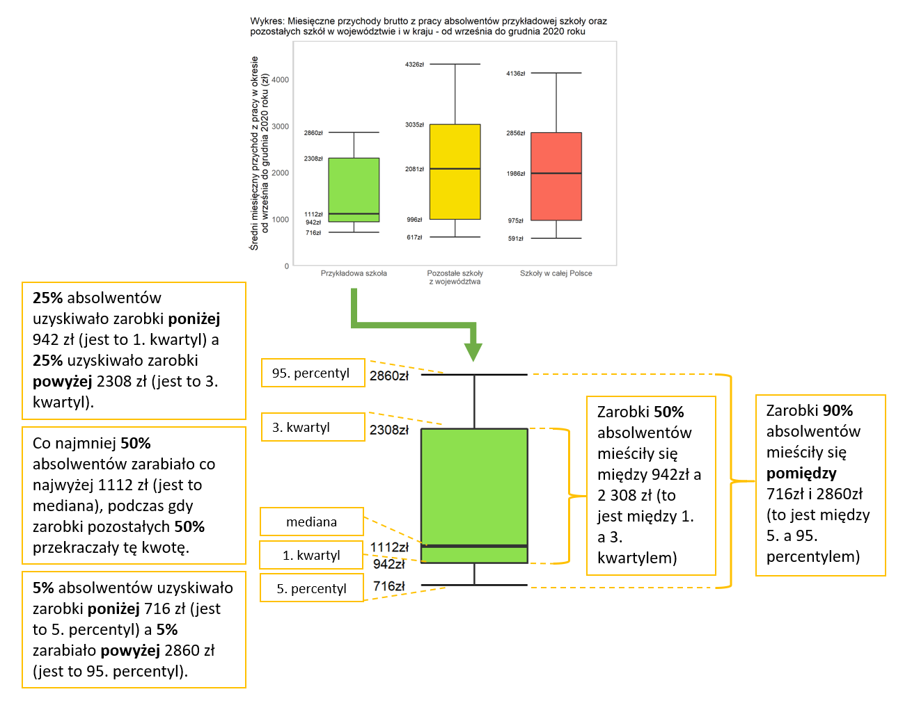

```{r, echo=FALSE, message=FALSE, warning=FALSE}
library(dplyr)
library(ggplot2)
library(kableExtra)
library(tidyr)
library(forcats)

library(MLASZraportyAdm2)
# if (!exists("params")) {
#   params = list(plikZObiektami = "../../../../07_Biezace_2022/20_RAPORTY_ADMIN_2/data/wskazniki/robocze/wskazniki_v1_robocze.RData",
#                 obiektWskazniki = "szk",
#                 obiektWskaznikiPorownanie = "god",
#                 obiektWskaznikiKraj = "kraj",
#                 progLiczebnosci = 10,
#                 typDokumentu = "pdf",
#                 wyrownanieTabWykr = "center",
#                 rok = 2021)
# }

progLiczebnosci = params$progLiczebnosci
typDokumentu = params$typDokumentu
wyrownanieTabWykr = params$wyrownanieTabWykr

if (params$plikZObiektami != "") {# to działa przy ręcznym prototypowaniu
  load(params$plikZObiektami)
  szk = get(params$obiektWskazniki)
  god = get(params$obiektWskaznikiPorownanie)
  kraj = get(params$obiektWskaznikiKraj)
} else {# to działa przy wywoływaniu przez generuj_raport()
  szk = get(params$obiektWskazniki)
  god = get(params$obiektWskaznikiPorownanie)
  kraj = get(params$obiektWskaznikiKraj)
}

god = god %>%
  filter(id_szk %in% szk$id_szk)

rocznik = paste0(params$rok - 1, "/", params$rok)
```

```{r testing, echo=FALSE, message=FALSE, warning=FALSE}
cat(
  "ID RSPO szkoły: ",
  szk$id_szk[[1]],
  "\nGrupa odniesienia: ",
  szk$odniesieniePoziom[[1]],
  "\nZmienna rocznik: ",
  rocznik,
  "\nLiczba absolwentów: ",
  szk$l_abs[[1]],
  sep = ""
)
```

`r ifelse(typDokumentu %in% "pdf", "---", "")`

`r ifelse(typDokumentu %in% "pdf", "\\vfill\n\\includegraphics{Belka-Losy-absolwentow-Kolor-PL}", "")`

`r ifelse(typDokumentu %in% "pdf", "\\newpage", "")`

# 1. Wprowadzenie

## Idea monitoringu

Monitoring karier absolwentów to nowe zadanie powierzone ministrowi właściwemu do spraw oświaty i wychowania na podstawie [Ustawy "Prawo oświatowe"](http://isap.sejm.gov.pl/isap.nsf/download.xsp/WDU20210000619/O/D20210619.pdf). Analogiczne rozwiązania funkcjonują od kilku lat w szkolnictwie wyższym. Monitoring jest prowadzony w celu zapewnienia informacji na temat przebiegu karier absolwentów na potrzeby prowadzenia polityki oświatowej państwa na poziomie krajowym, regionalnym i lokalnym. Wiarygodne i dostarczane cyklicznie statystyki opisujące przebieg karier edukacyjno-zawodowych absolwentów szkół ponadpodstawowych w Polsce mają pomóc w dostosowywaniu kierunków i treści kształcenia do wymogów rynku pracy. Wiedza ta może być użyteczna dla szkół, instytucji rynku pracy i pracodawców, a także pomóc uczniom w wyborze zawodu i kierunku kształcenia.

Należy pamiętać, że oprócz kształcenia w szkole ponadpodstawowej i umiejętności nabytych w czasie praktycznej nauki zawodu u pracodawcy, na sytuację edukacyjną i zawodową absolwentów wpływa wiele innych uwarunkowań. Do takich uwarunkowań należą wiedza i umiejętności zdobyte przed rozpoczęciem nauki w szkole oraz sytuacja na lokalnym rynku pracy. Dlatego informacji o losach absolwentów nie można, bez uwzględnienia dodatkowego kontekstu, traktować jako miary efektywności poszczególnych szkół.

## Źródła i przetwarzanie danych

Raporty są przygotowywane na podstawie danych z publicznych rejestrów. Monitoring opiera się na danych dotyczących nauki w szkołach ponadpodstawowych (dane Informatycznego Centrum Edukacji i Nauki) oraz na studiach (dane Ośrodka Przetwarzania Informacji nadzorowanego przez ministra właściwego ds. szkolnictwa wyższego i nauki), uzyskiwania dyplomów i świadectw (dane Okręgowych Komisji Egzaminacyjnych) oraz aktywności na rynku pracy (dane Zakładu Ubezpieczeń Społecznych).

Dzięki wykorzystaniu danych rejestrowych monitoring obejmuje niemal całą populację absolwentów.

Pozyskane dane są przetwarzane, łączone i anonimizowane przez Informatyczne Centrum Edukacji i Nauki.

Analizy i sporządzane automatycznie raporty są projektowane i przygotowywane przez Instytut Badań Edukacyjnych. 

## Absolwenci Państwa szkoły uwzględnieni w raporcie

```{r, echo=FALSE, message=FALSE, results='asis', fig.align=wyrownanieTabWykr, warning=FALSE}
odmiany = list(
  abs = ifelse(szk$l_abs[[1]] %in% 1, " absolwenta", " absolwentów"),
  kob = if (szk$l_kobiet[[1]] %in% 0:19) {
    case_when(
      szk$l_kobiet[[1]] %in% 0 ~ "kobiet",
      szk$l_kobiet[[1]] %in% 1 ~ "kobietę",
      szk$l_kobiet[[1]] %in% c(2:4) ~ "kobiety",
      szk$l_kobiet[[1]] %in% c(5:19) ~ "kobiet")
  } else {
    case_when(
      (szk$l_kobiet[[1]] %% 10) %in% c(0, 1, 5:9) ~ "kobiet",
      (szk$l_kobiet[[1]] %% 10) %in% c(2:4) ~ "kobiety")
  },
  abs_opi = ifelse(szk$l_abs_zrodla[[1]]$n_opi %in% 1, " absolwenta", " absolwentów"),
  abs_zus = ifelse(szk$l_abs_zrodla[[1]]$n_zus %in% 1, " absolwenta", " absolwentów"),
  osob_zus = if (szk$l_abs_zrodla[[1]]$n_zus[[1]] %in% 0:19) {
    case_when(
      szk$l_abs_zrodla[[1]]$n_zus %in% 0 ~ " osób",
      szk$l_abs_zrodla[[1]]$n_zus %in% 1 ~ " osoba",
      szk$l_abs_zrodla[[1]]$n_zus %in% c(2:4) ~ " osoby",
      szk$l_abs_zrodla[[1]]$n_zus %in% c(5:19) ~ " osób")
  } else {
    case_when(
      (szk$l_abs_zrodla[[1]]$n_zus %% 10) %in% c(0, 1, 5:9) ~ " osoby",
      (szk$l_abs_zrodla[[1]]$n_zus %% 10) %in% c(2:4) ~ " osób")
  },
  god_dop = case_when(
    szk$odniesieniePoziom %in% "powiat" ~ "powiatu",
    szk$odniesieniePoziom %in% "podregion" ~ "podregionu",
    szk$odniesieniePoziom %in% "województwo" ~ "województwa")
)

cat(
  ifelse(szk$l_abs[[1]] >= progLiczebnosci,
         paste0("Ten raport dotyczy "),
         paste0("Monitoring objął ")),
  szk$l_abs[[1]],
  odmiany$abs,
  " (w tym ",
  szk$l_kobiet[[1]],
  odmiany$kob,
  "), którzy ukończyli Państwa szkołę w roku szkolnym ",
  rocznik,
  "^[Na podstawie informacji pozyskanych z Informatycznego Centrum Edukacji i Nauki według stanu na 15 marca 2021 roku.]. Informacje o absolwentach pozyskano z Systemu Informacji Oświatowej według stanu bazy na 21 marca 2021 roku. Absolwentami są uczniowie ostatnich klas Państwa szkoły, którym w SIO zakończono przypisanie do oddziału wybierając status \"Ukończył szkołę\". Ze względu na zapewnienie kompletności danych w kolejnych raportach, ważne jest nadawanie przez szkoły takiego statusu absolwentom do końca roku kalendarzowego, w którym zakończyli naukę.\n\nLiczebność grup, dla których prezentowane są wyniki, zależy od dostępności informacji o Państwa absolwentach należących do danej grupy w poszczególnych rejestrach.\n\n* Ośrodek Przetwarzania Informacji przekazał dane dotyczące ",
  szk$l_abs_zrodla[[1]]$n_opi,
  odmiany$abs_opi,
  " Państwa szkoły, którzy rozpoczęli naukę na uczelniach wyższych do końca grudnia ", 
  params$rok,
  " roku (według stanu na 31 grudnia ROK roku).\n\n* Dane pozyskane z Zakładu Ubezpieczeń Społecznych obejmują okres od 1 stycznia ROK roku do 10 maja ROK roku. Informują o rejestrowanej przez ZUS aktywności zawodowej ",
  szk$l_abs_zrodla[[1]]$n_zus,
  odmiany$abs_zus,
  " Państwa szkoły.\n\n",
  sep = ""
)
```

## Sposób prezentowania sytuacji absolwentów

`r ifelse(szk$l_abs[[1]] >= progLiczebnosci, paste0("W raporcie opisujemy sytuację absolwentów Państwa szkoły z rocznika ", rocznik, " w ", params$rok, " roku. "), "")`Przypisanie absolwentowi określonego statusu (np. “uczy się” lub “pracuje”) w danym miesiącu oznacza, że przynajmniej przez jeden dzień w tym miesiącu miał taki status. 

Wyniki monitoringu prezentujemy w różnych ujęciach:

* Wartości danego wskaźnika w kolejnych miesiącach rozpatrywanego okresu pozwalają śledzić jak zmieniała się sytuacja edukacyjna i zawodowa absolwentów. W przypadku wskaźników odnoszących się do sytuacji edukacyjnej i zawodowej jest to okres od stycznia do grudnia `r params$rok` roku.

* Szczegółowe zestawienia dotycząc sytuacji edukacyjnej i zawodowej absolwentów odnoszą się do ich sytuacji w grudniu `r params$rok` roku, co pozwala na uwzględnienie m.in. kontynuowania przez część absolwentów szkół ponadpodstawowych nauki na studiach.

* Niektóre wskaźniki są zdefiniowane jako średnia wartość w danym okresie (przychód uzyskiwany z pracy) lub okres, w którym absolwent miał określony status (praca, bezrobocie, bierność edukacyjna i zawodowa). Takie wskaźniki obliczyliśmy dla okresu od września do grudnia `r params$rok` roku. Wrzesień jest pierwszym miesiącem, w którym absolwenci formalnie nie byli już uczniami Państwa szkoły, a grudzień ostatnim, dla którego w momencie sporządzania tego raportu dysponujemy kompletnymi danymi o absolwentach figurujących w rejestrach.

Niektóre wyniki dotyczące absolwentów `r ifelse(szk$l_abs[[1]] >= progLiczebnosci, paste0("Państwa szkoły"), paste0("poszczególnych szkół"))` zostały zestawione z wynikami dotyczącymi absolwentów pozostałych techników z danej grupy porównawczej^[Absolwenci Państwa szkoły są wykluczani z tej grupy porównawczej, ponieważ w niektórych przypadkach ich sytuacja mogłaby w dużym stopniu rzutować na wyniki dotyczące tej grupy.] oraz z całęgo kraju.

Ze względu na potrzebę zachowania anonimowości absolwentów, dane dla grup liczących poniżej 10 osób nie są prezentowane. W celu zachowania czytelności, na wykresach nie są umieszczane wartości etykiet poniżej 5%.

## Wykorzystanie raportu

Przy wykorzystywaniu informacji z raportów prosimy o podanie źródła:

*Raport szkolny z monitoringu karier absolwentów szkół ponadpodstawowych `r rocznik` prowadzonego w 2022 r. na podstawie danych administracyjnych. Warszawa: Instytut Badań Edukacyjnych, 2022.*

Raport jest dostępny na zasadach licencji ["Creative Commons Uznanie autorstwa-Użycie niekomercyjne-Na tych samych warunkach 4.0 Międzynarodowe"](https://creativecommons.org/licenses/by-nc-sa/4.0/deed.pl).

`r ifelse(typDokumentu %in% "pdf", "\\newpage", "")`

# 2. Ścieżki edukacyjno-zawodowe

## Kontynuowanie edukacji oraz wykonywanie pracy

Wskaźnik prezentowany w tym rozdziale wykorzystuje 6 statusów absolwentów opisujących ich sytuację edukacyjno-zawodową w różnych momentach. Poniższa tabela przybliża konstrukcję poszczególnych statusów.

```{r, echo=FALSE, message=FALSE, results='asis', fig.align=wyrownanieTabWykr, warning=FALSE}
data.frame(
  "UPDATE TABELI ZE STATUSAMI",
  check.names = FALSE) %>% 
  pivot_longer(everything()) %>% 
  rename(`Kategoria` = name,
         `Znaczenie kategorii` = value) %>% 
  filter(!row_number() %in% 1) %>% 
  kable(format = "latex",
        booktabs = TRUE,
        escape = FALSE,
        longtable = TRUE,
        align = "ll") %>% 
  kable_styling(position = wyrownanieTabWykr,
                latex_options = c("hold_position", "repeat_header"),
                repeat_header_text = "(ciąg dalszy tabeli)") %>% 
  column_spec(1, width = "4cm") %>%
  column_spec(2, width = "12cm")
```

```{r, echo=FALSE, message=FALSE, results='asis', fig.align=wyrownanieTabWykr, warning=FALSE}
if (szk$S3_12[[1]]$n >= progLiczebnosci) {
  cat(
    "Spośród absolwentów Państwa szkoły z rocznika ",
    rocznik,
    " w grudniu ",
    params$rok,
    " roku kształciło się ",
    round((szk$S3_12[[1]]$ucz_prac + szk$S3_12[[1]]$tylko_ucz) * 100),
    "%. Edukację w kolejnej szkole ponadpodstawowej z zatrudnieniem na podstawie umowy o pracę lub z wykonywaniem własnej działalności gospodarczej (samozatrudnieniem)^[W przypadku osób powyżej 26. roku życia uwzględniane jest ponadto wykonywanie pracy na podstawie umowy-zlecenia.] łączyło ",
    round(szk$S3_12[[1]]$ucz_prac * 100),
    "%. Odsetek takich osób wśród absolwentów Państwa szkoły był ",
    case_when(
      round(szk$S3_12[[1]]$ucz_prac * 100) < round(god$S3_12[[1]]$ucz_prac * 100) ~ "niższy, niż",
      round(szk$S3_12[[1]]$ucz_prac * 100) > round(god$S3_12[[1]]$ucz_prac * 100) ~ "wyższy, niż",
      round(szk$S3_12[[1]]$ucz_prac * 100) %in% round(god$S3_12[[1]]$ucz_prac * 100) ~ "taki sam, jak"
    ),
    " wśród absolwentów pozostałych techników z ", 
    odmiany$god_dop,
    " (",
    round(god$S3_12[[1]]$ucz_prac * 100),
    "%) oraz ",
    case_when(
      round(szk$S3_12[[1]]$ucz_prac * 100) < round(kraj$S3_12[[1]]$ucz_prac * 100) ~ "niższy, niż",
      round(szk$S3_12[[1]]$ucz_prac * 100) > round(kraj$S3_12[[1]]$ucz_prac * 100) ~ "wyższy, niż",
      round(szk$S3_12[[1]]$ucz_prac * 100) %in% round(kraj$S3_12[[1]]$ucz_prac * 100) ~ "taki sam, jak"
    ),
    " wśród absolwentów techników z całego kraju (",
    round(kraj$S3_12[[1]]$ucz_prac * 100),
    "%).\n\nZ kolei ",
    round(szk$S3_12[[1]]$tylko_ucz * 100),
    "% absolwentów Państwa szkoły w grudniu ", 
    params$rok,
    " 2020 roku kontynuowało naukę w kolejnej szkole ponadpodstawowej nie będąc etatowymi pracownikami ani nie prowadząc własnej działalności gospodarczej^[W przypadku osób powyżej 26. roku życia uwzględniane jest ponadto niewykonywanie pracy na podstawie umowy-zlecenia.]. Wśród absolwentów pozostałych techników z ",
    odmiany$god_dop,
    " analogiczny odsetek wynosił ",
    round(god$S3_12[[1]]$tylko_ucz * 100),
    "%, a wśród absolwentów techników z całego kraju ",
    round(kraj$S3_12[[1]]$tylko_ucz * 100),
    "%.\n\nW tym samym miesiącu ",
    round(szk$S3_12[[1]]$tylko_prac * 100),
    "% absolwentów Państwa szkoły pracowało^[Na podstawie umowy o pracę, umowy zlecenia lub prowadząc własną działalność gospodarczą.], ale nie uczęszczało do kolejnej szkoły. Do grupy absolwentów pracujących, ale nie kontynuujących edukacji formalnej należało ",
    round(god$S3_12[[1]]$tylko_prac * 100),
    "% absolwentów pozostałych techników z ",
    odmiany$god_dop,
    " oraz ",
    round(kraj$S3_12[[1]]$tylko_prac * 100),
    "% absolwentów techników z całego kraju.\n\nSpośród absolwentów Państwa szkoły w grudniu ",
    params$rok,
    " roku ",
    round(szk$S3_12[[1]]$neet * 100),
    "% nie kontynuowało nauki w szkole ponadpodstawowej, ani nie pracowało^[Na podstawie umowy o pracę, umowy zlecenia ani prowadząc własną działalność gospodarczą.]. Do tej grupy należą absolwenci zarejestrowani jako osoby bezrobotne, a także otrzymujący renty lub przebywający na urlopach wychowawczych oraz bierni zawodowo. W takiej sytuacji było ",
    round(god$S3_12[[1]]$neet * 100),
    "% absolwentów pozostałych techników z ",
    odmiany$god_dop,
    " oraz ",
    round(kraj$S3_12[[1]]$neet * 100),
    "% absolwentów tego typu szkół z całego kraju.\n\n",
    sep = ""
  )
} else {
  cat("Liczba absolwentów Państwa szkoły nie była wystarczająca (n < 10), żeby możliwe było przedstawienie wyników, zgodnie z zasadą chroniącą anonimowość respondentów.")
}
```

```{r, echo=FALSE, message=FALSE, results='asis', fig.align=wyrownanieTabWykr, warning=FALSE}
if (szk$S3_12[[1]]$n >= progLiczebnosci) {
  nazwy_wierszy = c(
    "Uczy się i pracuje",
    "Tylko się uczy",
    "Tylko pracuje",
    "Nie pracuje i nie uczy się")
  
  tab = tab_wykres(szk$S3_12[[1]],
                   god$S3_12[[1]],
                   kraj$S3_12[[1]],
                   odmiany$god_dop,
                   "białostockiego",
                   nazwy_wierszy,
                   # NAZWA_GOD_UZUZPELNIC, # muszę mieć tę zmienną, żeby działało!!!!
                   szk$typ_szk[[1]],
                   80)
  
  wykres_poziomy_statusy(
    tab,
    wrapper(paste0("Wykres ",
                   wyk_num(),
                   ": Status edukacyjno-zawodowy absolwentów Państwa szkoły oraz pozostałych techników w grupach odniesienia, w grudniu ",
                   params$rok,
                   " roku - ogółem"), 80))
}
```

```{r, echo=FALSE, message=FALSE, results='asis', fig.align=wyrownanieTabWykr, warning=FALSE}
if (szk$S3_12[[1]]$n >= progLiczebnosci) {
  cat(
    "\n\nStatus edukacyjno-zawodowy Państwa absolwentów różnił się w grudniu ",
    params$rok,
    " w zależności od zawodu, w którym ukończyli kształcenie.\n",
    sep = ""
  )
}
```

```{r, echo=FALSE, message=FALSE, results='asis', fig.align=wyrownanieTabWykr, warning=FALSE}
if (szk$S3_12[[1]]$n >= progLiczebnosci & !length(szk$tab_s3_zaw[[1]]) %in% 0) {
  tab_szk = szk$tab_s3_zaw[[1]] %>% 
    as_tibble() %>%  
    filter(!row_number() %in% nrow(.)) %>% 
    arrange(n, nazwa_zaw) %>%
    mutate(typ = ordered(nazwa_zaw, levels = unique(nazwa_zaw))) %>% 
    select(-c(n, nazwa_zaw)) %>%
    pivot_longer(cols = ucz_prac:neet, names_to = "name") %>% 
    mutate(across(name,
                  ~case_when(
                    . %in% "ucz_prac" ~ "Uczy się i pracuje",
                    . %in% "tylko_ucz" ~ "Tylko się uczy",
                    . %in% "tylko_prac" ~ "Tylko pracuje",
                    . %in% "neet" ~ "Nie pracuje i nie uczy się"))) %>% 
    mutate(lab = ifelse(round(value, 2) >= 0.06,
                        paste0(round(value * 100), "%"),
                        ""),
           name = ordered(name, levels = c(
             "Uczy się i pracuje",
             "Tylko się uczy",
             "Tylko pracuje",
             "Nie pracuje i nie uczy się")))
  
  wykres = wykres_poziomy_statusy(
    tab_szk,
    wrapper(paste0("Wykres ",
                   wyk_num(),
                   ": Status edukacyjno-zawodowy absolwentów Państwa szkoły w grudniu ",
                   params$rok,
                   " roku - w poszczególnych zawodach (%)"), 80))
  
  tabelka = szk$tab_s3_zaw[[1]] %>% 
    as_tibble()
  tabelka$nazwa_zaw = gsub("Ogółem", "Ogółem*", tabelka$nazwa_zaw)
  
  tabelka = tabelka %>% 
    mutate(across(ucz_prac:neet,
                  ~ round(. * 100))) %>%
    mutate(across(ucz_prac:neet,
                  ~ paste0(., "\\%"))) %>%
    slice_max(n = 10, order_by = n) %>%
    arrange(desc(n), desc(nazwa_zaw))
  
  tabelka = rbind(tabelka %>% filter(!nazwa_zaw %in% "Ogółem*"),
                  tabelka %>% filter(nazwa_zaw %in% "Ogółem*")) %>% 
    select(-n) %>% 
    kable(format = "latex", booktabs = TRUE, escape = FALSE, longtable = TRUE,
          linesep = "",
          align = "lcccc",
          col.names = NULL,
          digits = 0) %>% 
    kable_styling(position = wyrownanieTabWykr,
                  latex_options = c("hold_position", "repeat_header"),
                  font_size = 10,
                  full_width = TRUE,
                  repeat_header_text = "(ciąg dalszy tabeli)") %>% 
    add_header_above(c("Zawody, w których obecni absolwenci\nuczyli się w Państwa szkole:", "1" = 1, "2" = 1, "3" = 1, "4" = 1),
                     align = c("l", "c", "c", "c", "c")) %>%
    add_header_above(c(" ",
                       "1. Uczy się i pracuje\n2. Tylko się uczy\n3. Tylko pracuje\n4. Nie pracuje i nie uczy się" = 4),
                     align = c("c", "l")) %>% 
    column_spec(1, width = "6cm") %>%
    column_spec(2, width = "2.25cm") %>%
    column_spec(3, width = "2.25cm") %>%
    column_spec(4, width = "2.25cm") %>%
    column_spec(5, width = "2.25cm") %>%
    footnote(general = "*W kategorii ‘Ogółem’ uwzględniono wyłącznie absolwentów zawodów, w których kształciło się po minimum 10 osób.", general_title = "")
  
  cat(
    "Poniższy wykres przedstawia sytuację absolwentów Państwa szkoły wykształconych w poszczególnych zawodach, o ile kształciło się w nich co najmniej 10 osób.\n",
    sep = "")
  
  zwroc_wykres_tabela(wykres, tabelka)
} else {
  cat(
    "W przypadku żadnego zawodu liczba absolwentów Państwa szkoły nie była wystarczająca, żeby możliwe było przedstawienie wyników w tym ujęciu zgodnie z zasadą chroniącą anonimowość respondentów. Dlatego tabela z wynikami nie została zaprezentowana."
  )
}
```

```{r, echo=FALSE, message=FALSE, results='asis', fig.align=wyrownanieTabWykr, warning=FALSE}
if (szk$S3_12[[1]]$n >= progLiczebnosci) {
  sty_sier = c(
    "styczniu" = round(szk$S3_01[[1]]$tylko_ucz * 100),
    "lutym" = round(szk$S3_02[[1]]$tylko_ucz * 100), 
    "marcu" = round(szk$S3_03[[1]]$tylko_ucz * 100),
    "kwietniu" = round(szk$S3_04[[1]]$tylko_ucz * 100),
    "maju" = round(szk$S3_05[[1]]$tylko_ucz * 100),
    "czerwcu" = round(szk$S3_06[[1]]$tylko_ucz * 100),
    "lipcu" = round(szk$S3_07[[1]]$tylko_ucz * 100),
    "sierpniu" = round(szk$S3_08[[1]]$tylko_ucz * 100))
  
  wrz_gru = c(
    "wrześniu" = round(szk$S3_09[[1]]$tylko_ucz * 100) + round(szk$S3_09[[1]]$tylko_prac * 100),
    "październiku" = round(szk$S3_10[[1]]$tylko_ucz * 100) + round(szk$S3_10[[1]]$tylko_prac * 100), 
    "listopadzie" = round(szk$S3_11[[1]]$tylko_ucz * 100) + round(szk$S3_11[[1]]$tylko_prac * 100),
    "grudniu" = round(szk$S3_12[[1]]$tylko_ucz * 100) + round(szk$S3_12[[1]]$tylko_prac * 100))
  
  cat(
    "W ",
    params$rok,
    " roku zmieniały się proporcje pomiędzy grupami uczniów i absolwentów Państwa szkoły, wyodrębnionymi ze względu na aktywność edukacyjną i zawodową.\n\nW okresie od stycznia do sierpnia ",
    params$rok,
    " roku^[Tj. do momentu, kiedy obecni absolwenci Państwa szkoły przestali być jej uczniami.] odsetek uczniów ostatnich klas Państwa szkoły pracujących na podstawie umowy o pracę^[W tym na podstawie umowy o pracę w celu przygotowania zawodowego. W tym okresie dla żadnego z obecnych absolwentów Państwa szkoły nie możemy zaobserwować zatrudnienia na podstawie umowy zlecenia, ponieważ byli jeszcze uczniami - w przypadku uczniów i studentów do 26. roku życia nie są dostępne dane dotyczące ewentualnego wykonywania pracy na podstawie umów zleceń] lub samozatrudnionych, wynosił ",
    if (length(unique(sty_sier)) %in% 1) {
      paste0(round(szk$S3_01[[1]]$tylko_ucz * 100), "%.\n\n")
    } else {
      paste0(
        "od ",
        min(sty_sier),
        "% w ",
        paste(names(sty_sier[sty_sier == min(sty_sier)]), collapse = ", "),
        " do ",
        max(sty_sier),
        "% w ",
        paste(names(sty_sier[sty_sier == max(sty_sier)]), collapse = ", "),
        ".\n\n",
        sep = ""
      )
    },
    "Natomiast w okresie od września do grudnia ",
    params$rok,
    " odsetek absolwentów Państwa szkoły pracujących na podstawie umowy o pracę, samozatrudnionych, a także - w przypadku osób niekontynuujących nauki - pracujących na podstawie umowy zlecenia - wynosił łącznie ",
    if (length(unique(wrz_gru)) %in% 1) {
      paste0(round(szk$S3_09[[1]]$tylko_ucz * 100) + round(szk$S3_09[[1]]$tylko_prac * 100), "%.")
    } else {
      paste0(
        "od ",
        min(wrz_gru),
        ifelse(unique(names(wrz_gru[wrz_gru == min(wrz_gru)])) %in% "wrześniu", paste0("% we "), paste0("% w ")),
        paste(names(wrz_gru[wrz_gru == min(wrz_gru)]), collapse = ", "),
        " do ",
        max(wrz_gru),
        ifelse(unique(names(wrz_gru[wrz_gru == min(wrz_gru)])) %in% "wrześniu", paste0("% we "), paste0("% w ")),
        paste(names(wrz_gru[wrz_gru == max(wrz_gru)]), collapse = ", "),
        ".",
        sep = ""
      )
    },
    " Bardziej szczegółowe wyniki, uwzględniające również to czy absolwenci się uczyli, przedstawia poniższy wykres.\n\n",
    sep = ""
  )
}
```

```{r, echo=FALSE, message=FALSE, results='asis', fig.align=wyrownanieTabWykr, warning=FALSE}
szkoly_month = rbind(
  as_tibble(szk$S3_01[[1]]),
  as_tibble(szk$S3_02[[1]]),
  as_tibble(szk$S3_03[[1]]),
  as_tibble(szk$S3_04[[1]]),
  as_tibble(szk$S3_05[[1]]),
  as_tibble(szk$S3_06[[1]]),
  as_tibble(szk$S3_07[[1]]),
  as_tibble(szk$S3_08[[1]]),
  as_tibble(szk$S3_09[[1]]),
  as_tibble(szk$S3_10[[1]]),
  as_tibble(szk$S3_11[[1]]),
  as_tibble(szk$S3_12[[1]]))

if (min(szkoly_month$n) >= progLiczebnosci) {
  tab_szk = szkoly_month %>%
    mutate(month = 1:12) %>% 
    select(-n) %>% 
    pivot_longer(ucz_prac:neet) %>% 
    mutate(across(name,
                  ~case_when(
                    . %in% "ucz_prac" ~ "Uczy się i pracuje",
                    . %in% "tylko_ucz" ~ "Tylko się uczy",
                    . %in% "tylko_prac" ~ "Tylko pracuje",
                    . %in% "neet" ~ "Nie pracuje i nie uczy się"))) %>% 
    mutate(lab = ifelse(round(value, 2) >= 0.06,
                        paste0(round(value * 100), "%"),
                        "")) %>% 
    mutate(name = ordered(name, levels = c(
      "Uczy się i pracuje",
      "Tylko się uczy",
      "Tylko pracuje",
      "Nie pracuje i nie uczy się")))
  
  wykres = wave_chart(tab_szk,
             wrapper(paste0("Wykres ",
                            wyk_num(),
                            ": Status edukacyjno-zawodowy absolwentów Państwa szkoły w poszczególnych miesiącach ",
                            params$rok,
                            " roku - ogółem (%)"), 80)) +
    scale_x_continuous(n.breaks = 12,
                       # muszę dać to "0" = "NA", żeby mi się zaczynało od stycznia
                       labels = c("0" = "NA", "1" = "sty", "2" = "lut", "3" = "mar", "4" = "kwi", "5" = "maj", "6" = "cze", "7" = "lip", "8" = "sie", "9" = "wrz", "10" = "paź", "11" = "lis", "12" = "gru"))
  
  tabelka = szkoly_month %>%
    mutate(month = 1:12) %>% 
    select(-n) %>% 
    mutate(across(ucz_prac:neet,
                  ~ round(. * 100))) %>%
    mutate(across(ucz_prac:neet,
                  ~ paste0(., "\\%"))) %>% 
    pivot_longer(-month, names_to = "mies") %>%
    pivot_wider(names_from = month, values_from = value) %>% 
    mutate(mies = ordered(mies,
                          levels = c(
                            "ucz_prac",
                            "tylko_ucz",
                            "tylko_prac",
                            "neet"),
                          labels = c(
                            "Uczy się i pracuje",
                            "Tylko się uczy",
                            "Tylko pracuje",
                            "Nie pracuje i nie uczy się"))) %>% 
    arrange(mies) %>% 
    kable("latex", booktabs = TRUE, escape = FALSE, longtable = TRUE,
          linesep = "",
          align = "lcccccccccccc",
          col.names = NULL,
          digits = 0) %>% 
    kable_styling(position = wyrownanieTabWykr,
                  latex_options = c("hold_position", "repeat_header"),
                  font_size = 10,
                  full_width = TRUE,
                  repeat_header_text = "(ciąg dalszy tabeli)") %>% 
    add_header_above(c("", "sty" = 1, "lut" = 1, "mar" = 1, "kwi" = 1, "maj" = 1, "cze" = 1, "lip" = 1, "sie" = 1, "wrz" = 1, "paź" = 1, "lis" = 1, "gru" = 1),
                     align = c("l", "c", "c", "c", "c", "c", "c", "c", "c", "c", "c", "c", "c")) %>% 
    column_spec(1, width = "3.9cm") %>%
    column_spec(2, width = "0.7cm") %>%
    column_spec(3, width = "0.7cm") %>%
    column_spec(4, width = "0.7cm") %>%
    column_spec(5, width = "0.7cm") %>%
    column_spec(6, width = "0.7cm") %>%
    column_spec(7, width = "0.7cm") %>% 
    column_spec(8, width = "0.7cm") %>%
    column_spec(9, width = "0.7cm") %>%
    column_spec(10, width = "0.7cm") %>%
    column_spec(11, width = "0.7cm") %>%
    column_spec(12, width = "0.7cm") %>%
    column_spec(13, width = "0.7cm")
  
  zwroc_wykres_tabela(wykres, tabelka)
}
```

`r ifelse(typDokumentu %in% "pdf", "\\newpage", "")`

# 3. Formy dalszego kształcenia absolwentów

## Sposoby kontynuowania kształcenia w grudniu `r params$rok` roku

```{r, echo=FALSE, message=FALSE, results='asis', fig.align=wyrownanieTabWykr, warning=FALSE}
if (szk$E2_nauka_kontyn[[1]]$n >= progLiczebnosci) {
  sposoby = as_tibble(szk$E2_nauka_kontyn[[1]]) %>% 
    select(spolic, studia, kkz, kuz) %>% 
    pivot_longer(everything()) %>% 
    pull(value) %>% 
    sum()
  
  if (round(sposoby * 100) != 0) {
    if (round(sposoby * 100) != 50) {
      cat(
        "Wśród absolwentów Państwa szkoły z rocznika ",
        rocznik,
        " przeważały osoby, które w grudniu ",
        params$rok,
        " roku ",
        if (round(sposoby * 100) < 50) {
          paste0("nie kontynuowały kształcenia (uwzględniono również KKZ i KUZ).\n\n")
        } else if (round(sposoby * 100) > 50) {
          paste0("kontynuowały kształcenie (uwzględniono również KKZ i KUZ).\n\n")
        },
        sep = ""
      )
    }
    
    cat("Absolwenci Państwa szkoły kontynuowali naukę:\n\n")
    if (round(szk$E2_nauka_kontyn[[1]]$studia * 100) > 0) {
      cat(
        "* studiując na uczelni (",
        round(szk$E2_nauka_kontyn[[1]]$studia * 100),
        "%)\n",
        sep = ""
      )
    }
    if (round(szk$E2_nauka_kontyn[[1]]$spolic * 100) > 0) {
      cat(
        "* w szkole policealnej (",
        round(szk$E2_nauka_kontyn[[1]]$spolic * 100),
        "%)\n",
        sep = ""
      )
    }
    if (round(szk$E2_nauka_kontyn[[1]]$kkz * 100) > 0) {
      cat(
        "* na KKZ (",
        round(szk$E2_nauka_kontyn[[1]]$kkz * 100),
        "%)\n",
        sep = ""
      )
    }
    if (round(szk$E2_nauka_kontyn[[1]]$kuz * 100) > 0) {
      cat(
        "* na KUZ (",
        round(szk$E2_nauka_kontyn[[1]]$kuz * 100),
        "%)\n",
        sep = ""
      )
    }
    
    if (round(szk$E2_nauka_kontyn[[1]]$brak * 100) %in% 50) {
      cat(
        "Połowa absolwentów Państwa szkoły nie kontynuowała kształcenia.\n\n"
      )
    }
  } else {
    cat("Żaden z absolwentów Państwa szkoły z rocznika ",
        rocznik,
        " w grudniu ",
        params$rok,
        " roku nie kontynuował nauki w szkole policealnej, na studiach, na Kwalifikacyjnych Kursach Zawodowych ani na Kursach Umiejętności Zawodowych.",
        sep = "")
  }
} else {
  cat("Liczba absolwentów Państwa szkoły nie była wystarczająca (n < 10), żeby możliwe było przedstawienie wyników, zgodnie z zasadą chroniącą anonimowość respondentów.")
}
```

```{r, echo=FALSE, message=FALSE, results='asis', fig.align=wyrownanieTabWykr, warning=FALSE, fig.height=3}
if (szk$E2_nauka_kontyn[[1]]$n >= progLiczebnosci) {
  nazwy_wierszy = c(
    "bs1", # tej etykiety nie będzie bo nie biorę tej kolumny
    "lodd", # tej etykiety nie będzie bo nie biorę tej kolumny
    "Szkoła policealna",
    "Szkoła wyższa",
    "Kwalifikacyjny Kurs Zawodowy",
    "Kurs Umiejętności Zawodowych",
    "Nie kontynuują kształcenia")
  
  tab = tab_wykres(szk$E2_nauka_kontyn[[1]],
                   NULL,
                   NULL,
                   odmiany$god_dop,
                   "białostockiego",
                   nazwy_wierszy,
                   # NAZWA_GOD_UZUZPELNIC, # muszę mieć tę zmienną, żeby działało!!!!
                   szk$typ_szk[[1]],
                   80) %>%
    select(-typ) %>% 
    filter(!(name %in% c("bs1", "lodd"))) %>% 
    arrange(desc(value))
  
  tab_brak_kont = tab %>% 
    filter(name %in% "Nie kontynuują kształcenia")
  
  tab = rbind(
    tab %>% filter(name != "Nie kontynuują kształcenia"),
    tab_brak_kont
  ) %>% 
    mutate(lab = ifelse(round(value, 2) > 0,
                          paste0(round(value * 100), "%"),
                          ""))
  tab$name = ordered(tab$name, tab$name)
  
  wykres_poziomy_slupki(
    tab,
    wrapper(paste0("Wykres ",
                   wyk_num(),
                   ": Sposoby kontynuowania nauki przez absolwentów Państwa szkoły w grudniu ",
                   params$rok,
                   " roku - ogółem (%)"), 80))
  
  # czy to pójdzie czy musi być w następnym chunku, który obecnie ma eval=FALSE?
  cat("\\textcolor{black}{\\relscale{0.75}Odsetki mogą sumować się do więcej niż 100\\% ze względu na możliwość kontynuowania edukacji w więcej niż jednej formie.}")
}
```

```{r, eval=FALSE, echo=FALSE, message=FALSE, results='asis', fig.align=wyrownanieTabWykr, warning=FALSE, fig.height=3}
if (szk$E2_nauka_kontyn[[1]]$n >= progLiczebnosci) {
  cat("\\textcolor{black}{\\relscale{0.75}Odsetki mogą sumować się do więcej niż 100\\% ze względu na możliwość kontynuowania edukacji w więcej niż jednej formie.}")
}
```

## Kontynuowanie nauki na studiach w poszczególnych dziedzinach i dyscyplinach

```{r, echo=FALSE, message=FALSE, results='asis', fig.align=wyrownanieTabWykr, warning=FALSE}
if (round(szk$E2_nauka_kontyn[[1]]$studia * szk$E2_nauka_kontyn[[1]]$n) >= progLiczebnosci) {
  if (sum(szk$liczebnosc_branze_ucz[[1]]$n >= 10) %in% 1) {
    cat(
      "Jedyną branżą^[ Zgodnie z klasyfikacją zawodów szkolnictwa branżowego.], w której w Państwa szkole kształciło się co najmniej 10 jej obecnych absolwentów objętych monitoringiem, była branża ",
      szk$liczebnosc_branze_ucz[[1]]$branza[szk$liczebnosc_branze_ucz[[1]]$n >= 10],
      " (",
      szk$liczebnosc_branze_ucz[[1]]$n[szk$liczebnosc_branze_ucz[[1]]$n >= 10],
      " uczniów).\n\n",
      sep = ""
    )
  } else if (sum(szk$liczebnosc_branze_ucz[[1]]$n >= 10) > 1) {
    branze_ucz_kolejnosc = szk$liczebnosc_branze_ucz[[1]] %>%
      as_tibble() %>%
      select(-odsetek) %>%
      filter(n >= 10) %>% 
      arrange(desc(n))
    
    cat(
      "Branżami^[ Zgodnie z klasyfikacją zawodów szkolnictwa branżowego.], w których w Państwa szkole kształciło się po co najmniej 10 jej obecnych absolwentów objętych monitoringiem, były branże: ",
      paste(branze_ucz_kolejnosc$branza, collapse = ", "),
      " (kolejno: ",
      paste(branze_ucz_kolejnosc$n, collapse = ", "),
      " uczniów).\n\n",
      sep = ""
    )
  }
} else {
  cat(
    "Liczba absolwentów Państwa szkoły kontynuujących naukę na uczelni nie była wystarczająca, żeby - przy zachowaniu zasady chroniącej anonimowość respondentów - możliwe było przedstawienie tabeli z odsetkami absolwentów kontynuujących naukę w poszczególnych dziedzinach i dyscyplinach")
}
```

```{r, echo=FALSE, message=FALSE, results='asis', fig.align=wyrownanieTabWykr, warning=FALSE}
if (round(szk$E2_nauka_kontyn[[1]]$studia * szk$E2_nauka_kontyn[[1]]$n) >= progLiczebnosci) {
  if(!length(szk$liczebnosc_dziedziny[[1]]) %in% 0) {
    dziedziny_kont_kolejnosc = szk$liczebnosc_dziedziny[[1]] %>%
      as_tibble() %>%
      select(-n) %>%
      mutate(across(odsetek, ~round(. * 100))) %>% 
      arrange(desc(odsetek))
    if (nrow(dziedziny_kont_kolejnosc) %in% 1) {
      cat(
        "Jedyną dziedziną, w której w grudniu ",
        params$rok,
        " roku absolwenci Państwa szkoły kontynuowali naukę na uczelni, była dziedzina ",
        dziedziny_kont_kolejnosc$dziedzina_kont[dziedziny_kont_kolejnosc$odsetek > 0],
        ".\n\n",
        sep = ""
      )
    } else if ((nrow(dziedziny_kont_kolejnosc) > 1) & (max(dziedziny_kont_kolejnosc$odsetek) != min(dziedziny_kont_kolejnosc$odsetek))) {
      cat(
        "Dziedziną, w której w grudniu ",
        params$rok,
        " roku kontynuowało naukę najwięcej absolwentów Państwa szkoły, była dziedzina ",
        dziedziny_kont_kolejnosc$dziedzina_kont[dziedziny_kont_kolejnosc$odsetek == max(dziedziny_kont_kolejnosc$odsetek)],
        ". Kształciło się w niej ",
        max(dziedziny_kont_kolejnosc$odsetek),
        "% spośród absolwentów, którzy w grudniu ",
        params$rok,
        " roku studiowali.\n\n",
        sep = ""
      )
    } else if ((nrow(dziedziny_kont_kolejnosc) > 1) & (max(dziedziny_kont_kolejnosc$odsetek) == min(dziedziny_kont_kolejnosc$odsetek))) {
      cat(
        "Dziedzinami, w których w grudniu ",
        params$rok,
        " roku studiowali absolwenci Państwa szkoły, były dziedziny: ",
        paste0(dziedziny_kont_kolejnosc$dziedzina_kont, collapse = ", "),
        sep = ""
      )
    }
    
    tabela = szk$liczebnosc_dziedziny[[1]] %>% 
      as_tibble() %>% 
      select(-n) %>% 
      arrange(desc(odsetek)) %>% 
      mutate(across(odsetek,
                    ~ round(. * 100))) %>%
      mutate(across(odsetek,
                    ~ paste0(., "\\%"))) %>%
      kable("latex", booktabs = TRUE, escape = FALSE, longtable = TRUE,
            linesep = "",
            align = "lc",
            col.names = NULL,
            digits = 0) %>% 
      kable_styling(position = wyrownanieTabWykr,
                    latex_options = c("hold_position", "repeat_header"),
                    font_size = 10,
                    full_width = TRUE,
                    repeat_header_text = "(ciąg dalszy tabeli)") %>% 
      add_header_above(c(wrapper(paste0("Dziedziny, w których absolwenci Państwa szkoły kontynuowali naukę w grudniu ",
        params$rok,
        " roku"), 50),
        "% wśród absolwentów studiujących" = 1),
                       align = c("l", "l")) %>% 
      column_spec(1, width = "8cm") %>% 
      column_spec(2, width = "8cm")
    
    cat(
      "**Tabela ",
      tab_num(),
      ": Dziedziny, w których kontynuowali naukę absolwenci Państwa szkoły na studiach (%)**\n\n",
      tabela,
      "\n\n\\textcolor{black}{\\relscale{0.75}Odsetki mogą sumować się do więcej niż 100\\% ze względu na możliwość kontynuowania edukacji w więcej niż jednej dziedzinie.}",
      sep = ""
    )
  }
}
```

```{r, echo=FALSE, message=FALSE, results='asis', fig.align=wyrownanieTabWykr, warning=FALSE}
if (round(szk$E2_nauka_kontyn[[1]]$studia * szk$E2_nauka_kontyn[[1]]$n) >= progLiczebnosci) {
  if (!length(szk$liczebnosc_dyscypliny[[1]]) %in% 0) {
    dyscypliny_kont_kolejnosc = szk$liczebnosc_dyscypliny[[1]] %>%
      as_tibble() %>%
      select(-n) %>%
      mutate(across(odsetek, ~round(. * 100))) %>% 
      arrange(desc(odsetek))
    if (nrow(dyscypliny_kont_kolejnosc) %in% 1) {
      cat(
        "Jedyną dyscypliną, w której w grudniu ",
        params$rok,
        " roku absolwenci Państwa szkoły kontynuowali naukę na uczelni, była dyscyplina ",
        dyscypliny_kont_kolejnosc$dyscyplina_wiodaca_kont[dyscypliny_kont_kolejnosc$odsetek > 0],
        ".\n\n",
        sep = ""
      )
    } else if ((nrow(dyscypliny_kont_kolejnosc) > 1) & (max(dyscypliny_kont_kolejnosc$odsetek) != min(dyscypliny_kont_kolejnosc$odsetek))) {
      cat(
        "Dyscypliną, w której w grudniu ",
        params$rok,
        " roku kontynuowało naukę najwięcej absolwentów Państwa szkoły, była dyscyplina ",
        dyscypliny_kont_kolejnosc$dyscyplina_wiodaca_kont[dyscypliny_kont_kolejnosc$odsetek == max(dyscypliny_kont_kolejnosc$odsetek)],
        ". Kształciło się w niej ",
        max(dyscypliny_kont_kolejnosc$odsetek),
        "% spośród absolwentów, którzy w grudniu ",
        params$rok,
        " roku studiowali.\n\n",
        sep = ""
      )
    } else if ((nrow(dyscypliny_kont_kolejnosc) > 1) & (max(dyscypliny_kont_kolejnosc$odsetek) == min(dyscypliny_kont_kolejnosc$odsetek))) {
      cat(
        "Dyscyplinami, w których w grudniu ",
        params$rok,
        " roku studiowali absolwenci Państwa szkoły, były dyscypliny: ",
        paste0(dyscypliny_kont_kolejnosc$dyscyplina_wiodaca_kont, collapse = ", "),
        sep = ""
      )
    }
    
    tabela = szk$liczebnosc_dyscypliny[[1]] %>% 
      as_tibble() %>% 
      select(-n) %>% 
      slice_max(n = 10, order_by = odsetek, with_ties = FALSE) %>% 
      mutate(across(odsetek,
                    ~ round(. * 100))) %>%
      mutate(across(odsetek,
                    ~ paste0(., "\\%"))) %>%
      kable("latex", booktabs = TRUE, escape = FALSE, longtable = TRUE,
            linesep = "",
            align = "lc",
            col.names = NULL,
            digits = 0) %>% 
      kable_styling(position = wyrownanieTabWykr,
                    latex_options = c("hold_position", "repeat_header"),
                    font_size = 10,
                    full_width = TRUE,
                    repeat_header_text = "(ciąg dalszy tabeli)") %>% 
      add_header_above(c(
        wrapper(paste0("Dyscypliny, w których absolwenci Państwa szkoły kontynuowali naukę w grudniu ",
                       params$rok,
                       " roku"), 50),
        "% wśród absolwentów studiujących" = 1),
        align = c("l", "l")) %>% 
      column_spec(1, width = "8cm") %>% 
      column_spec(2, width = "8cm") %>% 
      footnote(general = "W tabeli prezentowanych jest maksymalnie 10 dyscyplin o najwyższych odsetkach kontynuacji", general_title = "")
    
    cat(
      "**Tabela ",
      tab_num(),
      ": Dyscypliny, w których absolwenci Państwa szkoły najczęściej kontynuowali naukę na studiach (%)**\n\n",
      tabela,
      sep = ""
    )
  }
}
```

`r ifelse(typDokumentu %in% "pdf", "\\newpage", "")`

# 4. Praca po ukończeniu technikum

## Odsetek miesięcy, w których absolwenci pracowali od września do grudnia `r params$rok` roku

Poszczególni absolwenci w okresie od września do grudnia `r params$rok` roku mogli pracować w ciągu maksymalnie 4 miesięcy. W takim przypadku wartość wskaźnika dla danego absolwenta wynosi 100%. Z kolei wartość minimalną, czyli 0%, wskaźnik przyjmuje dla absolwentów, którzy nie pracowali w tym okresie w ciągu żadnego miesiąca.

```{r, echo=FALSE, message=FALSE, results='asis', fig.align=wyrownanieTabWykr, warning=FALSE}
if (szk$Z4_ucz[[1]]$n >= progLiczebnosci) {
  cat("W przypadku absolwentów, którzy w danym miesiącu byli studentami lub uczniami szkoły policealnej, bierzemy pod uwagę jedynie pracę na etat oraz samozatrudnienie, ponieważ w ich przypadku brak informacji na temat zatrudnienia na podstawie umów zleceń^[ Ze względu na brak w rejestrze ZUS danych dotyczące ewentualnego wykonywania pracy na podstawie umów zleceń przez uczniów i studentów do 26. roku życia.].\n\n")
}

if (szk$Z4_nie_ucz[[1]]$n >= progLiczebnosci) {
  cat("W przypadku absolwentów, którzy w danym miesiącu nie kontynuowali nauki na uczelni ani w szkole policealnej, jako “pracę” uwzględniamy zarówno pracę na etat oraz samozatrudnienie, jak i pracę na podstawie umowy zlecenia.\n\n")
}

if ((szk$Z4_ucz[[1]]$n >= progLiczebnosci) & (szk$Z4_nie_ucz[[1]]$n >= progLiczebnosci)) {
  cat("W związku z tym wskaźnik jest prezentowany oddzielnie dla każdej z tych grup^[ Ten sam absolwent, jeżeli był uczniem tylko przez część rozpatrywanego okresu, jest uwzględniany w dwóch grupach. Na przykład absolwent, który uczył się od września do listopada a pracował od października do grudnia zostałby uwzględniony z wartością wskaźnika 67% w grupie absolwentów będących uczniami oraz z wartością wskaźnika 100% w grupie absolwentów nieuczących się.].\n\n")
}
```

### Absolwenci w okresie, gdy byli studentami lub uczniami szkół policealnych

```{r, echo=FALSE, message=FALSE, results='asis', fig.align=wyrownanieTabWykr, warning=FALSE}
if (szk$Z4_ucz[[1]]$n >= progLiczebnosci) {
  cat(
    "Absolwenci Państwa szkoły, którzy kontynuowali naukę na uczelni lub w szkole policealnej, pracowali średnio w ciągu ",
    round(szk$Z4_ucz[[1]]$srednia * 100),
    "% okresu od września do grudnia ",
    params$rok,
    " roku.\n\nDla absolwentów pozostałych techników z ",
    odmiany$god_dop,
    " kontynuujących naukę na uczelni lub w szkole policealnej, średnia arytmetyczna odsetka przepracowanych miesięcy wyniosła ",
    round(god$Z4_ucz[[1]]$srednia * 100),
    "%. W skali całego kraju średnia wynosiła ",
    round(kraj$Z4_ucz[[1]]$srednia * 100),
    "%.\n\n",
    sep = ""
  )
  
  przeprac_ods = szk$Z4_ucz[[1]] %>% 
    as_tibble() %>% 
    pivot_longer(everything()) %>% 
    as.list()
  przeprac_ods$name = c(
    paste0("od września do grudnia ", params$rok, " roku nie pracowały"),
    paste0("pracowały przez cały okres od września do grudnia ", params$rok),
    paste0("pracowały przez część okresu od września do grudnia ", params$rok))
  
  if (length(przeprac_ods$name[przeprac_ods$value %in% max(przeprac_ods$value)]) %in% 1) {
    cat(
      "Wśród absolwentów Państwa szkoły kontynuujących naukę najliczniejsza była grupa osób, które ",
      przeprac_ods$name[przeprac_ods$value %in% max(przeprac_ods$value)],
      ". Grupa ta stanowiła ",
      round(max(przeprac_ods$value) * 100),
      "% absolwentów Państwa szkoły.\n\n",
      sep = ""
    )
  } else if (length(przeprac_ods$name[przeprac_ods$value %in% max(przeprac_ods$value)]) > 1) {
    cat(
      "Wśród absolwentów Państwa szkoły kontynuujących naukę najliczniejsze były grupy osób, które ",
      paste0(przeprac_ods$name[przeprac_ods$value %in% max(przeprac_ods$value)], collapse = ", "),
      ". Grupy te stanowiły po ",
      round(max(przeprac_ods$value) * 100),
      "% absolwentów Państwa szkoły.\n\n",
      sep = ""
    )
  } else if (min(przeprac_ods$value) == max(przeprac_ods$value)) {
    cat(
      "Wśród absolwentów Państwa szkoły kontynuujących naukę wszystkie grupy osób, wyróżnione ze względu na to przez jaką część okresu poświęconego na naukę pracowały (od września do grudnia ",
      params$rok,
      " roku) były równoliczne. Każda z tych grup stanowiła ",
      round(max(przeprac_ods$value) * 100),
      "% absolwentów Państwa szkoły.\n\n",
      sep = ""
    )
  }
} else {
  cat("Liczba absolwentów Państwa szkoły pracujących oraz kontynuujących naukę na uczelni lub w szkole policealnej, nie była wystarczająca, żeby możliwe było przedstawienie wyników dla tej grupy, zgodnie z zasadą chroniącą anonimowość respondentów.\n\n")
}
```

```{r, echo=FALSE, message=FALSE, results='asis', fig.align=wyrownanieTabWykr, warning=FALSE}
if (szk$Z4_ucz[[1]]$n >= progLiczebnosci) {  
  etykiety = c("srednia", "mediana", "p0", "czesc", "p100")
  
  tab_wyk = tab_wykres(szk$Z4_ucz[[1]],
                       god$Z4_ucz[[1]],
                       kraj$Z4_ucz[[1]],
                       odmiany$god_dop,
                       "białostockiego",
                       etykiety,
                       # NAZWA_GOD_UZUZPELNIC, # muszę mieć tę zmienną, żeby działało!!!!
                       szk$typ_szk[[1]],
                       80) %>% 
    select(-lab) %>% 
    filter(!(name %in% c("srednia", "mediana"))) %>% 
    pivot_wider() %>% 
    pivot_longer(cols = p0:p100) %>%  
    mutate(lab = paste0(round(value * 100), "%"))
  
  tab_wyk$name = ordered(tab_wyk$name,
                         levels = c("p0", "czesc", "p100"),
                         labels = c("brak\npracy", "część\nokresu", "cały\nokres"))
  
  wyk_tyt = wrapper(paste0("Wykres ",
                           wyk_num(),
                           ": Procentowy udział grup wyróżnionych ze względu na część przepracowanego okresu wśród absolwentów Państwa szkoły oraz pozostałych techników w ",
                           odmiany$god_dop,
                           " i w kraju, od września do grudnia ",
                           params$rok,
                           " roku - studiujący lub uczący się w szkołach policealnych."),
           width = 85)
  
  wykres = wyk_facet(tab_wyk,
            wyk_tyt,
            "name",
            "Przepracowany okres") +
    geom_text(data = tab_wyk,
              aes(x = name, y = value, label = lab, group = typ),
              nudge_y = 0.03,
              size = 2.5)
  
  tab_wyk = tab_wyk %>%
    select(-lab) %>% 
    pivot_wider(names_from = name) %>%
    mutate(across(2:4,
                  ~ round(. * 100))) %>%
    mutate(across(2:4,
                  ~ paste0(., "\\%"))) %>%
    kable("latex", booktabs = TRUE, escape = FALSE, longtable = TRUE,
          linesep = "",
          align = "lccc",
          col.names = NULL,
          digits = 0) %>%
    kable_styling(position = wyrownanieTabWykr,
                  latex_options = c("hold_position", "repeat_header"),
                  font_size = 10,
                  full_width = FALSE,
                  repeat_header_text = "(ciąg dalszy tabeli)") %>%
    add_header_above(c(" ", "Brak pracy" = 1, "Część okresu" = 1, "Cały okres" = 1),
                     align = c("l", "c", "c", "c"))
  
  zwroc_wykres_tabela(wykres, tab_wyk)
}
```

### Absolwenci w okresie, gdy nie byli studentami ani słuchaczami szkół policealnych

```{r, echo=FALSE, message=FALSE, results='asis', fig.align=wyrownanieTabWykr, warning=FALSE}
if (szk$Z4_nie_ucz[[1]]$n >= progLiczebnosci) {
  cat(
    "W okresie od września do grudnia ",
    params$rok,
    " absolwenci Państwa szkoły, którzy nie byli wtedy studentami ani słuchaczami szkoły policealnej, pracowali średnio w ciągu ",
    round(szk$Z4_nie_ucz[[1]]$srednia * 100),
    "% tego okresu.\n\nDla niekontynuujących nauki na uczelni ani w szkole policealnej absolwentów pozostałych techników z ",
    odmiany$god_dop,
    " średnia arytmetyczna odsetka przepracowanych miesięcy wyniosła ",
    round(god$Z4_nie_ucz[[1]]$srednia * 100),
    "%, a w skali całego kraju ",
    round(kraj$Z4_nie_ucz[[1]]$srednia * 100),
    "%.\n\n",
    sep = ""
  )
  
  przeprac_ods = szk$Z4_nie_ucz[[1]] %>% 
    as_tibble() %>% 
    pivot_longer(everything()) %>% 
    as.list()
  przeprac_ods$name = c(
    paste0("od września do grudnia ", params$rok, " roku nie pracowały"),
    paste0("pracowały przez cały okres od września do grudnia ", params$rok),
    paste0("pracowały przez część okresu od września do grudnia ", params$rok))
  
  if (length(przeprac_ods$name[przeprac_ods$value %in% max(przeprac_ods$value)]) %in% 1) {
    cat(
      "Wśród niekontynuujących nauki absolwentów Państwa szkoły najliczniejsza była grupa osób, które ",
      przeprac_ods$name[przeprac_ods$value %in% max(przeprac_ods$value)],
      ". Grupa ta stanowiła ",
      round(max(przeprac_ods$value) * 100),
      "% absolwentów Państwa szkoły.\n\n",
      sep = ""
    )
  } else if (length(przeprac_ods$name[przeprac_ods$value %in% max(przeprac_ods$value)]) > 1) {
    cat(
      "Wśród niekontynuujących nauki absolwentów Państwa szkoły najliczniejsze były grupy osób, które ",
      paste0(przeprac_ods$name[przeprac_ods$value %in% max(przeprac_ods$value)], collapse = ", "),
      ". Grupy te stanowiły po ",
      round(max(przeprac_ods$value) * 100),
      "% absolwentów Państwa szkoły.\n\n",
      sep = ""
    )
  } else if (min(przeprac_ods$value) == max(przeprac_ods$value)) {
    cat(
      "Wśród niekontynuujących nauki absolwentów Państwa szkoły wszystkie grupy osób, wyróżnione ze względu na przepracowaną część okresu (od września do grudnia ",
      params$rok,
      " roku), w którym się nie uczyły, były równoliczne. Każda z tych grup stanowiła ",
      round(max(przeprac_ods$value) * 100),
      "% absolwentów Państwa szkoły.\n\n",
      sep = ""
    )
  }
} else {
  cat("Liczba absolwentów Państwa szkoły pracujących ale nie kontynuujących nauki na uczelni ani w szkole policealnej nie była wystarczająca, żeby możliwe było przedstawienie wyników dla tej grupy, zgodnie z zasadą chroniącą anonimowość respondentów.\n\n")
}
```

```{r, echo=FALSE, message=FALSE, results='asis', fig.align=wyrownanieTabWykr, warning=FALSE}
if (szk$Z4_nie_ucz[[1]]$n >= progLiczebnosci) {
  etykiety = c("srednia", "mediana", "p0", "czesc", "p100")
  
  tab_wyk = tab_wykres(szk$Z4_nie_ucz[[1]],
                       god$Z4_nie_ucz[[1]],
                       kraj$Z4_nie_ucz[[1]],
                       odmiany$god_dop,
                       "białostockiego",
                       etykiety,
                       # NAZWA_GOD_UZUZPELNIC, # muszę mieć tę zmienną, żeby działało!!!!
                       szk$typ_szk[[1]],
                       80) %>% 
    select(-lab) %>% 
    filter(!(name %in% c("srednia", "mediana"))) %>% 
    pivot_wider() %>% 
    pivot_longer(cols = p0:p100) %>% 
    mutate(lab = paste0(round(value * 100), "%"))
  
  tab_wyk$name = ordered(tab_wyk$name,
                         levels = c("p0", "czesc", "p100"),
                         labels = c("brak\npracy", "część\nokresu", "cały\nokres"))
  
  wyk_tyt = wrapper(paste0("Wykres ",
                           wyk_num(),
                           ": Procentowy udział grup wyróżnionych ze względu na część przepracowanego okresu wśród absolwentów Państwa szkoły oraz pozostałych techników w ",
                           odmiany$god_dop,
                           " i w kraju, września do grudnia ",
                           params$rok,
                           " - nie studiujący ani nie uczący się w szkołach policealnych"),
           width = 85)
  
  wykres = wyk_facet(tab_wyk,
                     wyk_tyt,
                     "name",
                     "Przepracowany okres") +
    geom_text(data = tab_wyk,
              aes(x = name, y = value, label = lab, group = typ),
              nudge_y = 0.03,
              size = 2.5)
  
  tab_wyk = tab_wyk %>%
    select(-lab) %>% 
    pivot_wider(names_from = name) %>%
    mutate(across(2:4,
                  ~ round(. * 100))) %>%
    mutate(across(2:4,
                  ~ paste0(., "\\%"))) %>%
    kable("latex", booktabs = TRUE, escape = FALSE, longtable = TRUE,
          linesep = "",
          align = "lccc",
          col.names = NULL,
          digits = 0) %>%
    kable_styling(position = wyrownanieTabWykr,
                  latex_options = c("hold_position", "repeat_header"),
                  font_size = 10,
                  full_width = FALSE,
                  repeat_header_text = "(ciąg dalszy tabeli)") %>%
    add_header_above(c(" ", "Brak pracy" = 1, "Część okresu" = 1, "Cały okres" = 1),
                     align = c("l", "c", "c", "c"))
  
  zwroc_wykres_tabela(wykres, tab_wyk)
}
```

## Formy wykonywania pracy w grudniu `r params$rok` roku

### Absolwenci kontynuujący naukę

```{r, echo=FALSE, message=FALSE, results='asis', fig.align=wyrownanieTabWykr, warning=FALSE, fig.height=6}
if (szk$Z8_formy_ucz[[1]]$n >= progLiczebnosci) {
  cat(
    "W grudniu ",
    params$rok,
    " roku spośród absolwentów Państwa szkoły, którzy uczyli się w kolejnej szkole ponadpodstawowej, a zarazem pracowali, ",
    round(szk$Z8_formy_ucz[[1]]$ucz_uop * 100),
    "% było zatrudnionych na umowę o pracę, a ",
    round(szk$Z8_formy_ucz[[1]]$ucz_samoz * 100),
    "% prowadziło własną działalność gospodarczą. Absolwentów, którzy pracowali na podstawie innej formy wykonywania pracy było ", 
    round(szk$Z8_formy_ucz[[1]]$ucz_inna * 100),
    "%. Z kolei ",
    round(szk$Z8_formy_ucz[[1]]$ucz_wiecej * 100),
    "% łączyło zatrudnienie na podstawie umowy o pracę z prowadzeniem własnej działalności gospodarczej.\n\nWśród kontynuujących naukę absolwentów pozostałych techników z ",
    odmiany$god_dop,
    " analogiczne odsetki wynosiły odpowiednio: ",
    round(god$Z8_formy_ucz[[1]]$ucz_uop * 100),
    "%, ",
    round(god$Z8_formy_ucz[[1]]$ucz_samoz * 100),
    "%, ",
    round(god$Z8_formy_ucz[[1]]$ucz_inna * 100),
    "% i ",
    round(god$Z8_formy_ucz[[1]]$ucz_wiecej * 100),
    "%, a w skali całego kraju ",
    round(kraj$Z8_formy_ucz[[1]]$ucz_uop * 100),
    "%, ",
    round(kraj$Z8_formy_ucz[[1]]$ucz_samoz * 100),
    "%, ",
    round(kraj$Z8_formy_ucz[[1]]$ucz_inna * 100),
    "% i ",
    round(kraj$Z8_formy_ucz[[1]]$ucz_wiecej * 100),
    "%.\n\n",
    sep = ""
  )
} else {
  cat("Liczba absolwentów Państwa szkoły pracujących oraz kontynuujących naukę na studiach lub w szkole policealnej nie była wystarczająca, żeby możliwe było przedstawienie wyników dla tej grupy, zgodnie z zasadą chroniącą anonimowość respondentów.\n\n")
}
```

```{r, echo=FALSE, message=FALSE, results='asis', fig.align=wyrownanieTabWykr, warning=FALSE, fig.height=6}
if (szk$Z8_formy_ucz[[1]]$n >= progLiczebnosci) {
  etykiety = c("Zatrudnieni tylko na podstawie umowy o pracę",
               "Tylko samozatrudnieni",
               "Tylko zatrudnieni na podstawie innej formy umowy",
               "Zatrudnieni na podstawie więcej niż jednej formy umowy")
  
  tab_wyk = tab_wykres(szk$Z8_formy_ucz[[1]],
                       god$Z8_formy_ucz[[1]],
                       kraj$Z8_formy_ucz[[1]],
                       odmiany$god_dop,
                       "białostockiego",
                       etykiety,
                       # NAZWA_GOD_UZUZPELNIC, # muszę mieć tę zmienną, żeby działało!!!!
                       szk$typ_szk[[1]],
                       80)
  
  wyk_tyt = wrapper(paste0("Wykres ",
                           wyk_num(),
                           ": Formy wykonywania pracy przez absolwentów Państwa szkoły oraz pozostałych techników w ",
                           odmiany$god_dop,
                           " i w kraju, w grudniu ",
                           params$rok,
                           " roku - pracujący i uczący się (%)"),
           width = 85)
  
  wykres = wykres_pion_skum(tab_wyk, wyk_tyt) +
    scale_fill_manual(values = c("#90cf60", "#d8ef8a", "#f8dd00", "#fb8c59")) +
    ylab("Odsetek absolwentów")
  
  tab_wyk = tab_wyk %>%
    select(-lab) %>%
    pivot_wider(names_from = name) %>%
    mutate(across(2:5,
                  ~ round(. * 100))) %>%
    mutate(across(2:5,
                  ~ paste0(., "\\%"))) %>%
    kable("latex", booktabs = TRUE, escape = FALSE, longtable = TRUE,
          linesep = "",
          align = "lccc",
          col.names = NULL,
          digits = 0) %>%
    kable_styling(position = wyrownanieTabWykr,
                  latex_options = c("hold_position", "repeat_header"),
                  font_size = 10,
                  full_width = FALSE,
                  repeat_header_text = "(ciąg dalszy tabeli)") %>%
    add_header_above(c(" ", "Zatrudnieni tylko\nna UOP" = 1, "Samozatrudnieni\nbez UOP" = 1, "Samozatrudnieni\noraz praca na UOP" = 1),
                     align = c("l", "c", "c", "c"))
  
  zwroc_wykres_tabela(wykres, tab_wyk)
}
```

### Absolwenci nie kontynuujący nauki

```{r, echo=FALSE, message=FALSE, results='asis', fig.align=wyrownanieTabWykr, warning=FALSE, fig.height=6}
if (szk$Z8_formy_nie_ucz[[1]]$n >= progLiczebnosci) {
  szk_minus_god = list(
    nieucz_uop = round(szk$Z8_formy_nie_ucz[[1]]$nieucz_uop * 100) - round(god$Z8_formy_nie_ucz[[1]]$nieucz_uop * 100),
    nieucz_samoz = round(szk$Z8_formy_nie_ucz[[1]]$nieucz_samoz * 100) - round(god$Z8_formy_nie_ucz[[1]]$nieucz_samoz * 100),
    nieucz_inna = round(szk$Z8_formy_nie_ucz[[1]]$nieucz_inna * 100) - round(god$Z8_formy_nie_ucz[[1]]$nieucz_inna * 100),
    nieucz_wiecej = round(szk$Z8_formy_nie_ucz[[1]]$nieucz_wiecej * 100) - round(god$Z8_formy_nie_ucz[[1]]$nieucz_wiecej * 100))
  
  cat(
    "W przypadku pracujących absolwentów Państwa szkoły, którzy nie kontynuowali nauki na studiach, w szkole policealnej ani w kolejnej szkole ponadpodstawowej, w grudniu ",
    params$rok,
    " roku dla ",
    round(szk$Z8_formy_nie_ucz[[1]]$nieucz_uop * 100),
    "% jedyną formą zatrudnienia była umowa o pracę, ",
    round(szk$Z8_formy_nie_ucz[[1]]$nieucz_samoz * 100),
    "% pracowało wyłącznie prowadząc własną działalność gospodarczą, a ",
    round(szk$Z8_formy_nie_ucz[[1]]$nieucz_inne * 100),
    "% było zatrudnionych tylko w innej formie, czyli przeważnie na podstawie umowy zlecenia. Pozostali (",
    round(szk$Z8_formy_nie_ucz[[1]]$nieucz_wiecej * 100),
    "%) łączyli co najmniej dwie formy zatrudnienia.\n\nNiekontynuujący nauki absolwenci Państwa szkoły pracowali wyłącznie na podstawie umowy o pracę ",
    case_when(
      szk_minus_god$nieucz_uop > 3 ~ "częściej niż",
      szk_minus_god$nieucz_uop >= -3 & szk_minus_god$nieucz_uop <= 3 ~ "podobnie często, co",
      szk_minus_god$nieucz_uop < -3 ~ "rzadziej niż"),
    " nie będący uczniami ani studentami absolwenci pozostałych techników z ",
    odmiany$god_dop,
    ". Zarazem niekontynuujący nauki absolwenci Państwa szkoły ",
    case_when(
      szk_minus_god$nieucz_samoz > 3 ~ "częściej niż",
      szk_minus_god$nieucz_samoz >= -3 & szk_minus_god$nieucz_samoz <= 3 ~ "podobnie często, co",
      szk_minus_god$nieucz_samoz < -3 ~ "rzadziej niż"),
    " absolwenci pozostałych szkół z ",
    odmiany$god_dop,
    " pracowali wyłącznie prowadząc własną działalność gospodarczą oraz ",
    case_when(
      szk_minus_god$nieucz_inna > 3 ~ "częściej niż",
      szk_minus_god$nieucz_inna >= -3 & szk_minus_god$nieucz_inna <= 3 ~ "podobnie często, co",
      szk_minus_god$nieucz_inna < -3 ~ "rzadziej niż"),
    " oni byli zatrudnieni tylko w formie innej niż samozatrudnienie i niż umowa o pracę.\n\n",
    sep = ""
  )
} else {
  cat("Liczba absolwentów Państwa szkoły pracujących ale nie kontynuujących nauki na studiach ani w szkole policealnej nie była wystarczająca, żeby możliwe było przedstawienie wyników dla tej grupy, zgodnie z zasadą chroniącą anonimowość respondentów.\n\n")
}
```

```{r, echo=FALSE, message=FALSE, results='asis', fig.align=wyrownanieTabWykr, warning=FALSE, fig.height=6}
if (szk$Z8_formy_nie_ucz[[1]]$n >= progLiczebnosci) {
  etykiety = c("Zatrudnieni tylko na podstawie umowy o pracę",
               "Tylko samozatrudnieni",
               "Tylko zatrudnieni na podstawie innej formy umowy",
               "Zatrudnieni na podstawie więcej niż jednej formy umowy")
  
  tab_wyk = tab_wykres(szk$Z8_formy_nie_ucz[[1]],
                       god$Z8_formy_nie_ucz[[1]],
                       kraj$Z8_formy_nie_ucz[[1]],
                       odmiany$god_dop,
                       "białostockiego",
                       etykiety,
                       # NAZWA_GOD_UZUZPELNIC, # muszę mieć tę zmienną, żeby działało!!!!
                       szk$typ_szk[[1]],
                       80)
  
  wyk_tyt = wrapper(paste0("Wykres ",
                           wyk_num(),
                           ": Formy wykonywania pracy przez absolwentów Państwa szkoły oraz pozostałych techników w ",
                           odmiany$god_dop,
                           " i w kraju, w grudniu ",
                           params$rok,
                           " roku - pracujący i nie uczący się (%)"),
           width = 85)
  
  wykres = wykres_pion_skum(tab_wyk, wyk_tyt) +
    scale_fill_manual(values = c("#90cf60", "#d8ef8a", "#f8dd00", "#fb8c59")) +
    ylab("Odsetek absolwentów")
  
  tab_wyk = tab_wyk %>%
    select(-lab) %>%
    pivot_wider(names_from = name) %>%
    mutate(across(2:5,
                  ~ round(. * 100))) %>%
    mutate(across(2:5,
                  ~ paste0(., "\\%"))) %>%
    kable("latex", booktabs = TRUE, escape = FALSE, longtable = TRUE,
          linesep = "",
          align = "lcccc",
          col.names = NULL,
          digits = 0) %>%
    kable_styling(position = wyrownanieTabWykr,
                  latex_options = c("hold_position", "repeat_header"),
                  font_size = 10,
                  full_width = FALSE,
                  repeat_header_text = "(ciąg dalszy tabeli)") %>%
    add_header_above(c(" ", "Tylko UOP" = 1, "Tylko\nsamozatrudnienie" = 1, "Tylko inna\nforma" = 1, "Więcej niż\njedna forma" = 1),
                     align = c("l", "c", "c", "c", "c"))
  
  zwroc_wykres_tabela(wykres, tab_wyk)
}
```

## Przychody brutto z pracy w okresie od września do grudnia `r params$rok` roku

Informacje dotyczące miesięcznych przychodów absolwentów nie uwzględniają czasu, jaki poświęcili na pracę (przychody te nie są przeliczone np. do wymiaru pełnego etatu). Ponadto należy pamiętać, że raporty oparte na danych rejestrowych nie uwzględniają zarobków uzyskiwanych w "szarej strefie".

Na poniższej ilustracji opisano sposób prezentowania danych na wykresie typu boxplot wraz z ich interpretacją. Dane na tym wykresie są fikcyjne - służy on tylko objaśnieniu jakiego rodzaju informacje można znaleźć na tego typu wykresach.

```{r, echo=FALSE, message=FALSE, warning=FALSE, out.width = '100%'}

```

### Absolwenci kontynuujący naukę

```{r, echo=FALSE, message=FALSE, results='asis', fig.align=wyrownanieTabWykr, warning=FALSE, fig.height=6}
if (szk$W1_ucz[[1]]$n >= progLiczebnosci) {
  cat(
    "W przypadku absolwentów Państwa szkoły, którzy studiowali lub uczyli się w szkole policealnej i przez co najmniej część okresu od września do grudnia ",
    params$rok,
    " roku pracowali^[Uwzględniono wyłącznie umowy o pracę oraz wykonywanie własnej działalności gospodarczej.], miesięczne przychody brutto^[Średnią (arytmetyczną) obliczono wyłącznie dla miesięcy, w których absolwenci pracowali. Nie uwzględniono przychodów osób, które przekroczyły kwotę rocznego ograniczenia podstawy wymiaru składek na ubezpieczenie emerytalne i rentowe (tj. 30 krotność prognozowanego wynagrodzenia brutto, czyli w ",
    params$rok + 1,
    " roku przeciętne miesięczne zarobki na poziomie 13 147 zł), w miesiącach, w których to przekroczenie wystąpiło.] w przepracowanych miesiącach wyniosły średnio ",
    round(szk$W1_ucz[[1]]$sred),
    " zł, a ich mediana ",
    round(szk$W1_ucz[[1]]$med),
    " zł. To znaczy, że co najmniej połowa grupy, dla której dostępne były informacje o zarobkach, uzyskiwała średni miesięczny przychód nieprzekraczający tej kwoty, a co najmniej połowa - przychód w wysokosci co najmniej tej kwoty. W przypadku absolwentów pozostałych techników z ",
    odmiany$god_dop,
    " łączących pracę z nauką średni miesięczny przychód z pracy wyniósł ",
    round(god$W1_ucz[[1]]$sred),
    " zł, a mediana ",
    round(god$W1_ucz[[1]]$med),
    " zł. W skali całego kraju wartości te wynosiły ",
    round(kraj$W1_ucz[[1]]$sred),
    " zł i ",
    round(kraj$W1_ucz[[1]]$med),
    " zł.\n\n",
    sep = ""
  )
} else {
  cat("Liczba absolwentów Państwa szkoły pracujących oraz studiujących lub uczących się w szkole policealnej nie była wystarczająca, żeby możliwe było przedstawienie wyników dla tej grupy, zgodnie z zasadą chroniącą anonimowość respondentów.")
}
```

```{r, echo=FALSE, message=FALSE, results='asis', fig.align=wyrownanieTabWykr, warning=FALSE, fig.height=6}
if (szk$W1_ucz[[1]]$n >= progLiczebnosci) {
  etykiety = c("sred", "q5", "q25", "med", "q75", "q95")
  
  tab_wyk = tab_wykres(szk$W1_ucz[[1]],
                       god$W1_ucz[[1]],
                       kraj$W1_ucz[[1]],
                       odmiany$god_dop,
                       "białostockiego",
                       etykiety,
                       # NAZWA_GOD_UZUZPELNIC, # muszę mieć tę zmienną, żeby działało!!!!
                       szk$typ_szk[[1]],
                       80) %>% 
    select(-lab) %>% 
    pivot_wider(names_from = name) %>% 
    select(-sred)
  
  wyk_lab = tab_wyk %>% 
    group_by(typ) %>% 
    summarise(value = list(q5, q25, med, q75, q95)) %>% 
    unnest() %>% 
    mutate(lab = paste0(round(value), "zł"))
  
  wyk_tyt = wrapper(paste0("Wykres ",
                           wyk_num(),
                           ": Miesięczne przychody brutto z pracy absolwentów Państwa szkoły oraz pozostałych techników w ",
                           odmiany$god_dop,
                           " i w kraju, od września do grudnia ",
                           params$rok,
                           " roku - pracujący i uczący się na studiach lub w szkole policealnej"),
           width = 85)
  
  wykres = boxplot_zl(x = tab_wyk,
                      tytul = wyk_tyt) +
    ylab(paste0("Średni miesięczny przychód z pracy w okresie\nod września do grudnia ",
                params$rok,
                " roku (zł)")) +
    geom_text(data = wyk_lab,
              aes(x = typ, y = value, label = lab),
              nudge_x = -0.4,
              size = 2.5)
  
  print(wykres)
  
  cat(
    "\\textcolor{black}{\\relscale{0.75}Na powyższym wykresie pogrubiona linia oznacza medianę średnich miesięcznych przychodów w danej grupie. Elementem wykresu jest również prostokąt, który “obejmuje” 50\\% absolwentów, którzy stanowią grupę środkową pod względem średnich miesięcznych przychodów w badanym okresie. Z kolei nad i pod prostokątem znajdują się poziome linie (tzw. wąsy). Pomiędzy tymi liniami zawierają się wartości wskaźnika dla “środkowych” 90\\% absolwentów. Im bardziej zróżnicowane są przychody w danej grupie, tym prostokąt jest wyższy, a odległość pomiędzy wspomnianymi liniami większa. \"Wąsy\" pokazują również minimalne i maksymalne miesięczne przychody w danej grupie, po wykluczeniu skrajnych wartości (5\\% najniższych i 5\\% najwyższych).}\n\n",
    sep = ""
  )
}
```

```{r, echo=FALSE, message=FALSE, results='asis', fig.align=wyrownanieTabWykr, warning=FALSE, fig.height=6}
if (szk$W1_ucz[[1]]$n >= progLiczebnosci) {
  tab_wyk %>%
    mutate(across(q5:q95,
                  ~paste0(round(.), "zł"))) %>%
    kable("latex", booktabs = TRUE, escape = FALSE, longtable = TRUE,
          linesep = "",
          align = "lccccc",
          col.names = NULL,
          digits = 0) %>%
    kable_styling(position = wyrownanieTabWykr,
                  latex_options = c("hold_position", "repeat_header"),
                  font_size = 10,
                  full_width = FALSE,
                  repeat_header_text = "(ciąg dalszy tabeli)") %>%
    add_header_above(c(" ", "5%" = 1, "25%" = 1, "Mediana" = 1, "75%" = 1, "95%"),
                     align = c("l", "c", "c", "c", "c", "c"))
}
```

### Absolwenci nie kontynuujący nauki

```{r, echo=FALSE, message=FALSE, results='asis', fig.align=wyrownanieTabWykr, warning=FALSE, fig.height=6}
if (szk$W1_nie_ucz[[1]]$n >= progLiczebnosci) {
  cat(
    "Niekontynuujący nauki absolwenci Państwa szkoły, którzy przez co najmniej część okresu od września do grudnia ",
    params$rok,
    " roku pracowali^[Uwzględniono zarówno umowy o pracę oraz wykonywanie własnej działalności gospodarczej, jak i umowy zlecenia, dlatego wartość wskaźnika nie jest porównywalna z wartością wskaźnika dla absolwentów będących uczniami.], uzyskiwali z tego tytułu średnie miesięczne wynagrodzenie brutto^[Średnią (arytmetyczną) obliczono wyłącznie dla miesięcy, w których absolwenci pracowali. Nie uwzględniono przychodów osób, które przekroczyły kwotę rocznego ograniczenia podstawy wymiaru składek na ubezpieczenie emerytalne i rentowe (tj. 30 krotność prognozowanego wynagrodzenia brutto, czyli w ",
    params$rok + 1,
    " roku przeciętne miesięczne zarobki na poziomie 13 147 zł), w miesiącach, w których to przekroczenie wystąpiło.] w wysokości ",
    round(szk$W1_nie_ucz[[1]]$sred),
    " zł. Mediana średniego miesięcznego przychodu z pracy wynosi z kolei wśród absolwentów Państwa szkoły ",
    round(szk$W1_nie_ucz[[1]]$med),
    " zł. To znaczy, że co najmniej połowa grupy, dla której dostępne były informacje o zarobkach, uzyskiwała średni miesięczny przychód nieprzekraczający tej kwoty, a co najmniej połowa - przychód w wysokości co najmniej tej kwoty. W przypadku absolwentów pozostałych techników z ",
    odmiany$god_dop,
    " średni miesięczny przychód z pracy wyniósł ",
    round(god$W1_nie_ucz[[1]]$sred),
    " zł a mediana ",
    round(god$W1_nie_ucz[[1]]$med),
    " zł. W skali całego kraju analogiczne wartości wynosiły i ",
    round(kraj$W1_nie_ucz[[1]]$sred),
    " zł i ",
    round(kraj$W1_nie_ucz[[1]]$med),
    " zł.\n\n",
    sep = ""
  )
} else {
  cat("Liczba absolwentów Państwa szkoły pracujących, ale nie studiujących ani nie uczących się w szkołach policealnych nie była wystarczająca, żeby możliwe było przedstawienie wyników dla tej grupy, zgodnie z zasadą chroniącą anonimowość respondentów.")
}
```

```{r, echo=FALSE, message=FALSE, results='asis', fig.align=wyrownanieTabWykr, warning=FALSE, fig.height=6}
if (szk$W1_nie_ucz[[1]]$n >= progLiczebnosci) {
  etykiety = c("sred", "q5", "q25", "med", "q75", "q95")
  
  tab_wyk = tab_wykres(szk$W1_nie_ucz[[1]],
                       god$W1_nie_ucz[[1]],
                       kraj$W1_nie_ucz[[1]],
                       odmiany$god_dop,
                       "białostockiego",
                       etykiety,
                       # NAZWA_GOD_UZUZPELNIC, # muszę mieć tę zmienną, żeby działało!!!!
                       szk$typ_szk[[1]],
                       80) %>% 
    select(-lab) %>% 
    pivot_wider(names_from = name) %>% 
    select(-sred)
  
  wyk_lab = tab_wyk %>% 
    group_by(typ) %>% 
    summarise(value = list(q5, q25, med, q75, q95)) %>% 
    unnest() %>% 
    mutate(lab = paste0(round(value), "zł"))
  
  wyk_tyt = wrapper(paste0("Wykres ",
                           wyk_num(),
                           ": Miesięczne przychody brutto absolwentów Państwa szkoły oraz pozostałych techników w ",
                           odmiany$god_dop,
                           " i w kraju, od września do grudnia ",
                           params$rok,
                           " roku - pracujący i nie studiujący ani nie uczący się w szkole policealnej"),
                    width = 85)
  
  wykres = boxplot_zl(tab_wyk, wyk_tyt) +
    ylab(paste0("Średni miesięczny przychód z pracy w okresie\nod grudnia ",
                params$rok,
                " roku (zł)")) +
    geom_text(data = wyk_lab,
              aes(x = typ, y = value, label = lab),
              nudge_x = -0.4,
              size = 2.5)
  
  print(wykres)
  
  cat(
    "\\textcolor{black}{\\relscale{0.75}Na powyższym wykresie pogrubiona linia oznacza medianę średnich miesięcznych przychodów w danej grupie. Elementem wykresu jest również prostokąt, który “obejmuje” 50\\% absolwentów, którzy stanowią grupę środkową pod względem średnich miesięcznych przychodów w badanym okresie. Z kolei nad i pod prostokątem znajdują się poziome linie (tzw. wąsy). Pomiędzy tymi liniami zawierają się wartości wskaźnika dla “środkowych” 90\\% absolwentów. Im bardziej zróżnicowane są przychody w danej grupie, tym prostokąt jest wyższy, a odległość pomiędzy wspomnianymi liniami większa. \"Wąsy\" pokazują również minimalne i maksymalne miesięczne przychody w danej grupie, po wykluczeniu skrajnych wartości (5\\% najniższych i 5\\% najwyższych).}\n\n",
    sep = ""
  )
}
```

```{r, echo=FALSE, message=FALSE, results='asis', fig.align=wyrownanieTabWykr, warning=FALSE, fig.height=6}
if (szk$W1_nie_ucz[[1]]$n >= progLiczebnosci) {
  tab_wyk %>%
    mutate(across(q5:q95,
                  ~paste0(round(.), "zł"))) %>%
    kable("latex", booktabs = TRUE, escape = FALSE, longtable = TRUE,
          linesep = "",
          align = "lccccc",
          col.names = NULL,
          digits = 0) %>%
    kable_styling(position = wyrownanieTabWykr,
                  latex_options = c("hold_position", "repeat_header"),
                  font_size = 10,
                  full_width = FALSE,
                  repeat_header_text = "(ciąg dalszy tabeli)") %>%
    add_header_above(c(" ", "5%" = 1, "25%" = 1, "Mediana" = 1, "75%" = 1, "95%"),
                     align = c("l", "c", "c", "c", "c", "c"))
}
```

## Przychody absolwentów z pracy etatowej w okresie od września do grudnia `r params$rok` roku w odniesieniu do średniego wynagrodzenia w powiatach, w których mieszkali

Wskaźnik, którego wartości prezentujemy na poniższym wykresie, pokazuje stosunek przychodów absolwentów Państwa szkoły z pracy etatowej do przeciętnego miesięcznego wynagrodzenia^[Według danych publikowanych w [Banku Danych Lokalnych Głównego Urzędu Statystycznego.](https://stat.gov.pl/metainformacje/slownik-pojec/pojecia-stosowane-w-statystyce-publicznej/693,pojecie.html?pdf=1)] osób mieszkających w tych samych powiatach. Dla poszczególnych absolwentów wartość wskaźnika równa 100% oznaczałaby, że ich średnie zarobki z pracy etatowej były takie same, jak przeciętne wynagrodzenie mieszkańców danego powiatu.

### Absolwenci kontynuujący naukę

```{r, echo=FALSE, message=FALSE, results='asis', fig.align=wyrownanieTabWykr, warning=FALSE}
if (szk$W3_ucz[[1]]$n >= progLiczebnosci) {
  cat(
    "Wartość mediany średnich zarobków absolwentów Państwa szkoły, zatrudnionych na podstawie umowy o pracę i kontynuujących naukę przypadła na poziomie ",
    round(szk$W3_ucz[[1]]$sred * 100),
    "% przeciętnych wynagrodzeń mieszkańców powiatów, w których mieszkali.\n\nDla pracujących na etat i uczących się absolwentów pozostałych techników z ",
    odmiany$god_dop,
    " wartość mediany wynosiła ",
    round(god$W3_ucz[[1]]$sred * 100),
    "%, natomiast na poziomie całego kraju ",
    round(kraj$W3_ucz[[1]]$sred * 100),
    "%.",
    sep = ""
  )
} else {
  cat("Liczba absolwentów Państwa szkoły pracujących na etat i uczących się nie była wystarczająca, żeby możliwe było przedstawienie wyników dla tej grupy zgodnie z zasadą chroniącą anonimowość respondentów.")
}
```

```{r, echo=FALSE, message=FALSE, results='asis', fig.align=wyrownanieTabWykr, warning=FALSE}
if (szk$W3_ucz[[1]]$n >= progLiczebnosci) {
  etykiety = c("sred", "q5", "q25", "med", "q75", "q95")
  
  tab_wyk = tab_wykres(szk$W3_ucz[[1]],
                       god$W3_ucz[[1]],
                       kraj$W3_ucz[[1]],
                       odmiany$god_dop,
                       "białostockiego",
                       etykiety,
                       # NAZWA_GOD_UZUZPELNIC, # muszę mieć tę zmienną, żeby działało!!!!
                       szk$typ_szk[[1]],
                       80) %>% 
    select(-lab) %>% 
    pivot_wider(names_from = name) %>% 
    select(-sred)
  
  wyk_lab = tab_wyk %>% 
    group_by(typ) %>% 
    summarise(value = list(q5, q25, med, q75, q95)) %>% 
    unnest() %>% 
    mutate(lab = paste0(round(value * 100), "%"))
  
  wyk_tyt = wrapper(paste0("Wykres ",
                           wyk_num(),
                           ": Średni miesięczny przychód z pracy absolwentów Państwa szkoły oraz pozostałych techników w ",
                           odmiany$god_dop,
                           " i w kraju z pracy etatowej w odniesieniu do średnich zarobków w poszczególnych zamieszkiwanych przez nich powiatach, od września do grudnia ",
                           params$rok,
                           " roku - pracujący i studiujący lub uczący się w szkole policealnej"),
                    width = 85)
  
  wykres = boxplot_proc(tab_wyk, wyk_tyt) +
    ylab(paste0("Przychody absolwenta z pracy etatowej w\nodniesieniu do średnich zarobków w jego\npowiecie dla okresu od września do\ngrudnia ",
                params$rok,
                " roku (%)")) +
    geom_text(data = wyk_lab,
              aes(x = typ, y = value, label = lab),
              nudge_x = -0.4,
              size = 2.5)
  
  print(wykres)
  
  cat(
    "\\textcolor{black}{\\relscale{0.75}Na powyższym wykresie pogrubiona linia oznacza medianę wartości prezentowanego wskaźnika Elementem wykresu jest również prostokąt, który “obejmuje” 50\\% absolwentów, którzy stanowią grupę środkową pod względem wartości analizowanego wskaźnika. Z kolei nad i pod prostokątem znajdują się poziome linie (tzw. wąsy). Pomiędzy tymi liniami zawierają się wartości wskaźnika dla “środkowych” 90\\% absolwentów. Im bardziej zróżnicowane są przychody w danej grupie, tym prostokąt jest wyższy, a odległość pomiędzy wspomnianymi liniami większa. \"Wąsy\" pokazują również minimalne i maksymalne wartości wskażnika w danej grupie, po wykluczeniu wartości skrajnych (5\\% najniższych i 5\\% najwyższych).}\n\n",
    sep = ""
  )
}
```

```{r, echo=FALSE, message=FALSE, results='asis', fig.align=wyrownanieTabWykr, warning=FALSE}
if (szk$W3_ucz[[1]]$n >= progLiczebnosci) {
  tab_wyk %>%
    mutate(across(q5:q95,
                  ~paste0(round(. * 100), "\\%"))) %>%
    kable("latex", booktabs = TRUE, escape = FALSE, longtable = TRUE,
          linesep = "",
          align = "lccccc",
          col.names = NULL,
          digits = 0) %>%
    kable_styling(position = wyrownanieTabWykr,
                  latex_options = c("hold_position", "repeat_header"),
                  font_size = 10,
                  full_width = FALSE,
                  repeat_header_text = "(ciąg dalszy tabeli)") %>%
    add_header_above(c(" ", "5%" = 1, "25%" = 1, "Mediana" = 1, "75%" = 1, "95%"),
                     align = c("l", "c", "c", "c", "c", "c"))
}
```

### Absolwenci nie kontynuujący nauki

```{r, echo=FALSE, message=FALSE, results='asis', fig.align=wyrownanieTabWykr, warning=FALSE}
if (szk$W3_nie_ucz[[1]]$n >= progLiczebnosci) {
  cat(
    "W przypadku absolwentów Państwa szkoły, którzy nie kontynuowali nauki wartość mediany wynosiła ",
    round(szk$W3_nie_ucz[[1]]$sred * 100),
    "% przeciętnych wynagrodzeń w powiatach, w których mieszkali. Dla pracujących na etat i nieuczących się absolwentów pozostałych techników z ",
    odmiany$god_dop,
     " wartość mediany wynosiła ",
    round(god$W3_nie_ucz[[1]]$sred * 100),
    "%, natomiast na poziomie całego kraju ",
    round(kraj$W3_nie_ucz[[1]]$sred * 100),
    "%.",
    sep = ""
  )
} else {
  cat("Liczba absolwentów Państwa szkoły pracujących na etat i nieuczących się nie była wystarczająca, żeby możliwe było przedstawienie wyników dla tej grupy zgodnie z zasadą chroniącą anonimowość respondentów.")
}
```

```{r, echo=FALSE, message=FALSE, results='asis', fig.align=wyrownanieTabWykr, warning=FALSE}
if (szk$W3_nie_ucz[[1]]$n >= progLiczebnosci) {
  etykiety = c("sred", "q5", "q25", "med", "q75", "q95")
  
  tab_wyk = tab_wykres(szk$W3_nie_ucz[[1]],
                       god$W3_nie_ucz[[1]],
                       kraj$W3_nie_ucz[[1]],
                       odmiany$god_dop,
                       "białostockiego",
                       etykiety,
                       # NAZWA_GOD_UZUZPELNIC, # muszę mieć tę zmienną, żeby działało!!!!
                       szk$typ_szk[[1]],
                       80) %>% 
    select(-lab) %>% 
    pivot_wider(names_from = name) %>% 
    select(-sred)
  
  wyk_lab = tab_wyk %>% 
    group_by(typ) %>% 
    summarise(value = list(q5, q25, med, q75, q95)) %>% 
    unnest() %>% 
    mutate(lab = paste0(round(value * 100), "%"))
  
  wyk_tyt = wrapper(paste0("Wykres ",
                           wyk_num(),
                           ": Średni miesięczny przychód z pracy absolwentów Państwa szkoły oraz pozostałych techników w ",
                           odmiany$god_dop,
                           " i w kraju z pracy etatowej w odniesieniu do średnich zarobków w poszczególnych zamieszkiwanych przez nich powiatach, od września do grudnia ",
                           params$rok,
                           " roku - pracujący i nie studiujący ani nie uczący się w szkole policealnej"),
           width = 85)
  
  wykres = boxplot_proc(tab_wyk, wyk_tyt) +
    ylab(paste0("Przychody absolwenta z pracy etatowej\nw odniesieniu do średnich zarobków w jego\npowiecie dla okresu od września do\ngrudnia ",
                params$rok,
                " roku (%)")) +
    geom_text(data = wyk_lab,
              aes(x = typ, y = value, label = lab),
              nudge_x = -0.4,
              size = 2.5)
  
  print(wykres)
  
  cat(
    "\\textcolor{black}{\\relscale{0.75}Na powyższym wykresie pogrubiona linia oznacza medianę wartości prezentowanego wskaźnika Elementem wykresu jest również prostokąt, który “obejmuje” 50\\% absolwentów, którzy stanowią grupę środkową pod względem wartości analizowanego wskaźnika. Z kolei nad i pod prostokątem znajdują się poziome linie (tzw. wąsy). Pomiędzy tymi liniami zawierają się wartości wskaźnika dla “środkowych” 90\\% absolwentów. Im bardziej zróżnicowane są przychody w danej grupie, tym prostokąt jest wyższy, a odległość pomiędzy wspomnianymi liniami większa. \"Wąsy\" pokazują również minimalne i maksymalne wartości wskażnika w danej grupie, po wykluczeniu wartości skrajnych (5\\% najniższych i 5\\% najwyższych).}\n\n",
    sep = ""
  )
}
```

```{r, echo=FALSE, message=FALSE, results='asis', fig.align=wyrownanieTabWykr, warning=FALSE}
if (szk$W3_nie_ucz[[1]]$n >= progLiczebnosci) {
  tab_wyk %>%
    mutate(across(q5:q95,
                  ~paste0(round(. * 100), "\\%"))) %>%
    kable("latex", booktabs = TRUE, escape = FALSE, longtable = TRUE,
          linesep = "",
          align = "lccccc",
          col.names = NULL,
          digits = 0) %>%
    kable_styling(position = wyrownanieTabWykr,
                  latex_options = c("hold_position", "repeat_header"),
                  font_size = 10,
                  full_width = FALSE,
                  repeat_header_text = "(ciąg dalszy tabeli)") %>%
    add_header_above(c(" ", "5%" = 1, "25%" = 1, "Mediana" = 1, "75%" = 1, "95%"),
                     align = c("l", "c", "c", "c", "c", "c"))
}
```

`r ifelse(typDokumentu %in% "pdf", "\\newpage", "")`

# 5. Bezrobocie i bierność edukacyjno-zawodowa absolwentów

## Bezrobocie rejestrowane od września do grudnia `r params$rok` roku

Poszczególni absolwenci Państwa szkoły pomiędzy jej ukończeniem, a końcem roku kalendarzowego, w którym to nastąpiło (tj. w okresie od września do grudnia `r params$rok` roku) mogli być zarejestrowani jako bezrobotni w ciągu maksymalnie czterech miesięcy.

```{r, echo=FALSE, message=FALSE, results='asis', fig.align=wyrownanieTabWykr, warning=FALSE, fig.height=3}
if (szk$l_abs[[1]] >= progLiczebnosci) {
  cat(
    "Wśród absolwentów Państwa szkoły ",
    round(szk$B2_bezrob[[1]]$value[szk$B2_bezrob[[1]]$l_mies_bezrob %in% 0] * 100),
    "% absolwentów w rozpatrywanym okresie w ogóle nie było zarejestrowanych jako osoby bezrobotne, natomiast ",
    round(szk$B2_bezrob[[1]]$value[szk$B2_bezrob[[1]]$l_mies_bezrob %in% 4] * 100),
    "% pozostawało w rejestrze osób bezrobotnych przez cały ten okres. Wśród absolwentów pozostałych techników z ",
    odmiany$god_dop,
    " analogiczne wartości wynosiły ",
    round(god$B2_bezrob[[1]]$value[god$B2_bezrob[[1]]$l_mies_bezrob %in% 0] * 100),
    "% i ",
    round(god$B2_bezrob[[1]]$value[god$B2_bezrob[[1]]$l_mies_bezrob %in% 4] * 100),
    "%, a w przypadku absolwentów techników z całego kraju ",
    round(kraj$B2_bezrob[[1]]$value[kraj$B2_bezrob[[1]]$l_mies_bezrob %in% 0] * 100),
    "% i ",
    round(kraj$B2_bezrob[[1]]$value[kraj$B2_bezrob[[1]]$l_mies_bezrob %in% 4] * 100),
    "%.\n\n",
    sep = ""
  )
  
  liczba_mies = szk$B2_bezrob[[1]] %>% 
    as_tibble() %>% 
    select(-c(n, srednia, mediana)) %>% 
    as.list()
  liczba_mies$l_mies_bezrob = c(
    "nie były zarejestrowane jako bezrobotne",
    "były zarejestrowane jako bezrobotne przez jeden miesiąc",
    "były zarejestrowane jako bezrobotne przez dwa miesiące",
    "były zarejestrowane jako bezrobotne przez trzy miesiące",
    "były zarejestrowane jako bezrobotne przez cztery miesiące"
  )
  
  if (length(liczba_mies$l_mies_bezrob[liczba_mies$value %in% max(liczba_mies$value)]) %in% 1) {
    cat(
      "Wśród absolwentów Państwa szkoły najliczniejsza była grupa osób, które w okresie od września do grudnia ",
      params$rok,
      " roku ",
      liczba_mies$l_mies_bezrob[liczba_mies$value %in% max(liczba_mies$value)],
      ".",
      sep = ""
    )
  } else if (length(liczba_mies$l_mies_bezrob[liczba_mies$value %in% max(liczba_mies$value)]) > 1) {
    cat(
      "Wśród absolwentów Państwa szkoły najliczniejsze były grupy osób, które w okresie od września do grudnia ",
      params$rok,
      " roku ",
      paste0(liczba_mies$l_mies_bezrob[liczba_mies$value %in% max(liczba_mies$value)], collapse = " oraz osób, które "),
      ".",
      round(max(liczba_mies$value) * 100),
      "% absolwentów Państwa szkoły.\n\n",
      sep = ""
    )
  } else if (min(liczba_mies$value) == max(liczba_mies$value)) {
    cat(
      "Wśród absolwentów Państwa wszystkie grupy osób, wyróżnione ze względu na liczbę miesięcy zarejestrowanego bezrobocia, w okresie od września do grudnia ",
      params$rok,
      " roku, były równoliczne. Każda z tych grup stanowiła ",
      round(max(liczba_mies$value) * 100),
      "% absolwentów Państwa szkoły.\n\n",
      sep = ""
    )
  }
} else {
  cat("Liczba absolwentów Państwa szkoły nie była wystarczająca (n < 10), żeby możliwe było przedstawienie wyników, zgodnie z zasadą chroniącą anonimowość respondentów.")
}
```

```{r, echo=FALSE, message=FALSE, results='asis', fig.align=wyrownanieTabWykr, warning=FALSE, fig.height=3}
if (szk$l_abs[[1]] >= progLiczebnosci) {
  tab_wyk = tab_facet(szk$B2_bezrob[[1]],
                      god$B2_bezrob[[1]],
                      kraj$B2_bezrob[[1]],
                      odmiany$god_dop,
                      "białostockiego",
                      # NAZWA_GOD_UZUZPELNIC, # muszę mieć tę zmienną, żeby działało!!!!
                      szk$typ_szk[[1]],
                      80)
  
  tab_wyk$mies = ordered(tab_wyk$mies, labels = c(
    "brak\nbezrobocia", "1 msc.", "2 msc.", "3 msc.", "4 msc."))
  
  wyk_tyt = wrapper(paste0("Wykres ",
                           wyk_num(),
                           ": Odsetek absolwentów Państwa szkoły oraz pozostałych techników w ",
                           odmiany$god_dop,
                           " i w kraju, którzy byli bezrobotni przez daną liczbę miesięcy, od września do grudnia ",
                           params$rok,
                           " roku"),
           width = 85)
  
  wykres = wyk_facet(tab_wyk,
            wyk_tyt,
            "mies",
            "Liczba miesięcy bezrobocia") +
    geom_text(data = tab_wyk,
              aes(x = mies, y = value, label = lab, group = typ),
              nudge_y = 0.03,
              size = 2.5)
  
  tab_wyk = tab_wyk %>%
    select(-lab) %>% 
    pivot_wider(names_from = mies) %>%
    mutate(across(2:6,
                  ~ round(. * 100))) %>%
    mutate(across(2:6,
                  ~ paste0(., "\\%"))) %>%
    kable("latex", booktabs = TRUE, escape = FALSE, longtable = TRUE,
          linesep = "",
          align = "lccccc",
          col.names = NULL,
          digits = 0) %>%
    kable_styling(position = wyrownanieTabWykr,
                  latex_options = c("hold_position", "repeat_header"),
                  font_size = 10,
                  full_width = FALSE,
                  repeat_header_text = "(ciąg dalszy tabeli)") %>%
    add_header_above(c(" ", "Brak\nbezrobocia" = 1, "1 miesiąc" = 1, "2 miesiące" = 1, "3 miesiące" = 1, "4 miesiące" = 1),
                     align = c("l", "c", "c", "c", "c", "c"))
  
  zwroc_wykres_tabela(wykres, tab_wyk)
}
```

## Liczba miesięcy bierności edukacyjnej i zawodowej od września do grudnia `r params$rok` roku

Wskaźnik mierzy długość okresu, w ciągu którego absolwenci Państwa szkoły nie pracowali, nie uczyli się w kolejnej szkole ponadpodstawowej, nie studiowali ani nie byli zarejestrowani jako osoby bezrobotne.

```{r, echo=FALSE, message=FALSE, results='asis', fig.align=wyrownanieTabWykr, warning=FALSE, fig.height=3}
if (szk$l_abs[[1]] >= progLiczebnosci) {
  liczba_mies = szk$N2_biernosc[[1]] %>% 
    as_tibble() %>% 
    select(-c(n, srednia, mediana)) %>% 
    as.list()
  liczba_mies$l_mies_bier = c(
    "nie były bierne edukacyjnie i zawodowo",
    "były bierne edukacyjnie i zawodowo przez jeden miesiąc",
    "były bierne edukacyjnie i zawodowo przez dwa miesiące",
    "były bierne edukacyjnie i zawodowo przez trzy miesiące",
    "były bierne edukacyjnie i zawodowo przez cztery miesiące"
  )
  
  if (length(liczba_mies$l_mies_bier[liczba_mies$value %in% max(liczba_mies$value)]) %in% 1) {
    cat(
      "Wśród absolwentów Państwa szkoły najliczniejsza była grupa osób, które w żadnym miesiącu w okresie od września do grudnia ",
      params$rok,
      " roku ",
      liczba_mies$l_mies_bier[liczba_mies$value %in% max(liczba_mies$value)],
      " - ",
      round(max(liczba_mies$value) * 100),
      "%.",
      sep = ""
    )
  } else if (length(liczba_mies$l_mies_bier[liczba_mies$value %in% max(liczba_mies$value)]) > 1) {
    cat(
      "Wśród absolwentów Państwa szkoły najliczniejsze były grupy osób, które w żadnym miesiącu w okresie od września do grudnia ",
      params$rok,
      " roku ",
      paste0(liczba_mies$l_mies_bier[liczba_mies$value %in% max(liczba_mies$value)], collapse = " oraz osób, które "),
      ". Grupy te stanowiły po ",
      round(max(liczba_mies$value) * 100),
      "% absolwentów Państwa szkoły.\n\n",
      sep = ""
    )
  } else if (min(liczba_mies$value) == max(liczba_mies$value)) {
    cat(
      "Wśród absolwentów Państwa wszystkie grupy osób, wyróżnione ze względu na liczbę miesięcy bierności edukacyjnej i zawodowej, w okresie od września do grudnia ",
      params$rok,
      " roku, były równoliczne. Każda z tych grup stanowiła ",
      round(max(liczba_mies$value) * 100),
      "% absolwentów Państwa szkoły.\n\n",
      sep = ""
    )
  }
} else {
  cat("Liczba absolwentów Państwa szkoły nie była wystarczająca (n < 10), żeby możliwe było przedstawienie wyników, zgodnie z zasadą chroniącą anonimowość respondentów.")
}
```

```{r, echo=FALSE, message=FALSE, results='asis', fig.align=wyrownanieTabWykr, warning=FALSE, fig.height=3}
if (szk$l_abs[[1]] >= progLiczebnosci) {
  tab_wyk = tab_facet(szk$N2_biernosc[[1]],
                      god$N2_biernosc[[1]],
                      kraj$N2_biernosc[[1]],
                      odmiany$god_dop,
                      "białostockiego",
                      # NAZWA_GOD_UZUZPELNIC, # muszę mieć tę zmienną, żeby działało!!!!
                      szk$typ_szk[[1]],
                      80)
  
  tab_wyk$mies = ordered(tab_wyk$mies, labels = c(
    "brak\nbierności", "1 msc.", "2 msc.", "3 msc.", "4 msc."))
  
  wyk_tyt = wrapper(paste0("Wykres ",
                           wyk_num(),
                           ": Odsetek absolwentów Państwa szkoły oraz pozostałych techników w ",
                           odmiany$god_dop,
                           " i w kraju, którzy byli bierni edukacyjnie i zawodowo przez daną liczbę miesięcy, od września do grudnia ",
                           params$rok,
                           " roku"),
           width = 85)
  
  wykres = wyk_facet(tab_wyk,
            wyk_tyt,
            "mies",
            "Liczba miesięcy bierności") +
    geom_text(data = tab_wyk,
              aes(x = mies, y = value, label = lab, group = typ),
              nudge_y = 0.03,
              size = 2.5)
  
  tab_wyk = tab_wyk %>%
    select(-lab) %>% 
    pivot_wider(names_from = mies) %>%
    mutate(across(2:6,
                  ~ round(. * 100))) %>%
    mutate(across(2:6,
                  ~ paste0(., "\\%"))) %>%
    kable("latex", booktabs = TRUE, escape = FALSE, longtable = TRUE,
          linesep = "",
          align = "lccccc",
          col.names = NULL,
          digits = 0) %>%
    kable_styling(position = wyrownanieTabWykr,
                  latex_options = c("hold_position", "repeat_header"),
                  font_size = 10,
                  full_width = FALSE,
                  repeat_header_text = "(ciąg dalszy tabeli)") %>%
    add_header_above(c(" ", "Brak\nbierności" = 1, "1 miesiąc" = 1, "2 miesiące" = 1, "3 miesiące" = 1, "4 miesiące" = 1),
                     align = c("l", "c", "c", "c", "c", "c"))
  
  zwroc_wykres_tabela(wykres, tab_wyk)
}
```

`r ifelse(typDokumentu %in% "pdf", "\\newpage", "")`

`r ifelse(typDokumentu %in% "pdf", "---", "")`

Instytut Badań Edukacyjnych pragnie podziękować dyrektorom szkół, nauczycielom i doradcom zawodowym, którzy wzięli udział w spotkaniach poświęconych wstępnym wersjom raportów szkolnych z monitoringu. Zgłoszone uwagi posłużyły do ulepszenia pierwszej edycji raportów i zostaną wykorzystane w pracach nad kolejnymi.

Więcej informacji o monitorowaniu losów absolwentów znajdą Państwo na stronie:

<https://losyabsolwentow.ibe.edu.pl/>
